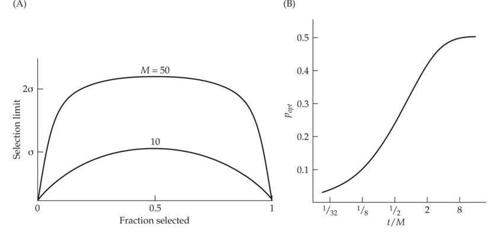
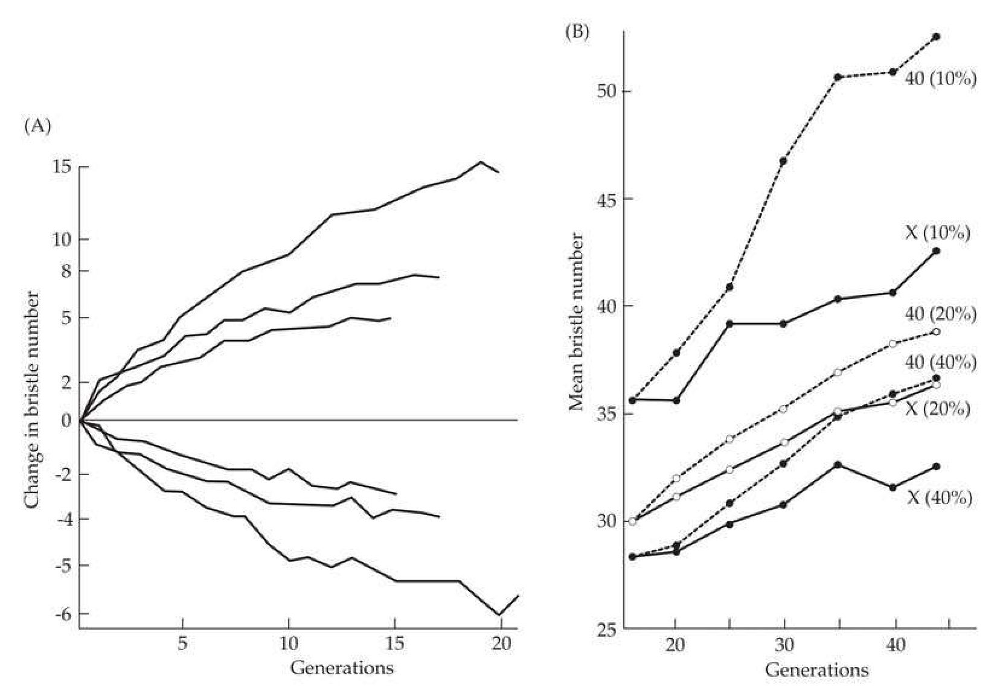
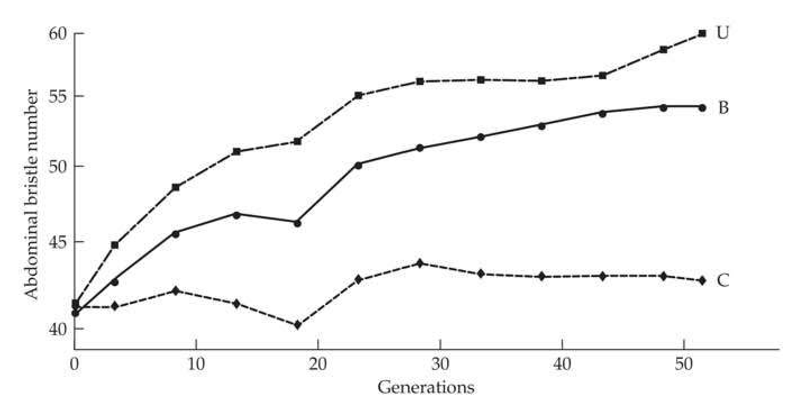
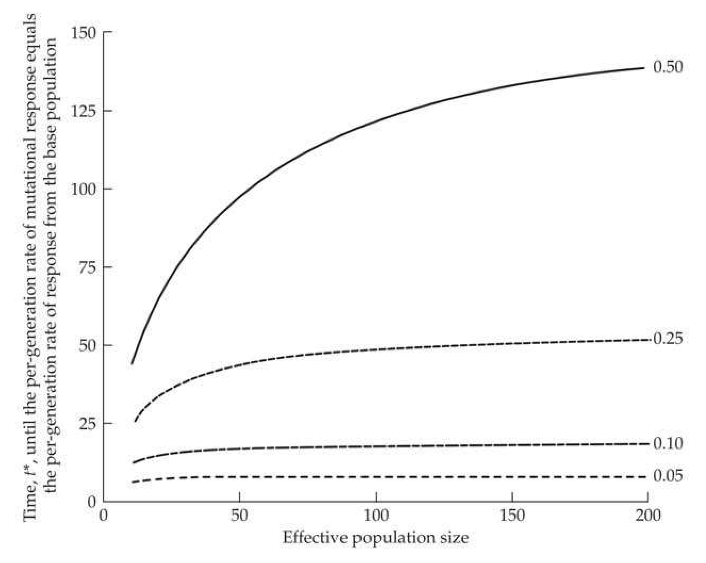

## chapter26_015 · Long-term Response: Introduction / OPTIMAL SELECTION INTENSITIES FOR MAXIMIZING LONG-TERM RESPONSE

**[推导 Derivation]**

When a fixed number, $M$, of individuals is scored, there is a tradeoff between the intensity of selection ($\bar{t}$) and the amount of drift ($N_e$). If $N$ individuals are allowed to reproduce (implying $p = N/M$ is the fraction saved), decreasing $N$ (and hence $p$) increases $\bar{t}$ but also decreases $N_e$. Recalling Equation 26.15b, Robertson’s selection limit can be expressed as

> **Formula (26.22)** · `26.22` · source: `chapter26_block_091` · OPTIMAL SELECTION INTENSITIES FOR MAXIMIZING LONG-TERM RESPONSE
>
> $$ 2N_{e}R(1)=N_{e}\bar{\tau}\left(\frac{2\sigma_{A}^{2}(0)}{\sigma_{z}}\right) $$

showing that the ultimate response (from the initial variation) depends on the product of $ N_e $ and $ \bar{\nu} $. While decreasing p results in a larger short-term response due to increased $ \bar{\nu} $, it also results in a decreased long-term response by decreasing $ N_e $. Hence, the product $ N_e $ decreases for sufficiently large or small values of p, suggesting that some intermediate value of p is optimal (see Equation 26.23). Table 26.3 and Figure 26.5 both illustrate this tradeoff. For example, while the single-generation response using p = 0.50 is less than half that for p = 0.10, it yields a selection limit over twice as large (200 vs. 90).

**[推导 Derivation]**

Supporting an earlier conjecture of Dempster (1955b), Robertson (1960a) found (for additive loci and normally distributed phenotypes) that the intensity of selection that yields the largest total response is $p = 0.5$, as $N_e \bar{i}$ is maximized for fixed $M$ when half the population is saved. This can be seen directly for truncation selection on a normally distributed character. Recall from Equation 14.3a that $\bar{i} = \varphi(x_{[1-p]}) / p$ (ignoring the correction for finite population size), where $x_p$ satisfies $\Pr(U < x_{[p]}) = p$, and with $U$ denoting a unit normal random variable and $\varphi(x)$ denotes the unit normal density function. Because the number saved is $N = M p$, we have (following Hospital and Chevalet 1993)

> **Formula (26.23)** · `26.23` · source: `chapter26_block_092` · OPTIMAL SELECTION INTENSITIES FOR MAXIMIZING LONG-TERM RESPONSE
>
> $$ \begin{align*}R(t)&\simeq M p\left(1-e^{-t/2N_{e}}\right)\frac{\varphi(x_{[1-p]})\sigma_{A}^{2}(0)}{p\sigma_{z}}\\&=\varphi(x_{[1-p]})\left[\frac{M\sigma_{A}^{2}(0)}{\sigma_{z}}\left(1-e^{-t/2N_{e}}\right)\right]\end{align*} $$

Because the term in brackets is independent of $p$, response (as a function of $p$) is maximized at the maximum value of $\varphi(x_{[1-p]})$, which occurs at $x = 0$, or a $p$ value of 0.5. As Figure 26.5 illustrates, the selection limit as a function of p becomes extremely flat-topped as M increases, so even fairly large deviations from p = 0.50 yield essentially the same limit. If we relax the assumption of normality, Cockerham and Burrows (1980) found that the optimal proportion for truncation selection is still near 0.50, unless the phenotypic distribution is extremely skewed. Hill and Robertson (1966), Robertson (1970a), and Hospital and Chevalet (1993) found that the optimal proportion increases to above p = 0.50 when linkage is important (recall from Chapter 24 that linkage disequilibrium generates skew in the genotypic distribution, causing it to depart from a normal).

**[Figure]**

> **Figure 26.5** · page 21 · source: `chapter26`
>
> 
>
> Figure 26.5 A: The selection limit as a function of the fraction selected (allowed to reproduce) for 10 and 50 individuals scored. (After Robertson 1960a.) B: The optimal proportion,  $ p_{opt} $, of individuals selected in each generation to maximize the selection advance over t generations, as a function of t/M, where M is the number of measured individuals. (After Robertson 1970b.) Both sets of curves can be generated using Equation 26.23, taking  $ M = N_{e} $.

**[Table]**

> **Table 26.4** · `26.4` · page 21 · source: `chapter26_015`
> Table 26.4 As selection intensity increases, the value of  $ N_e $ becomes increasingly less than the actual number of parents ( $ N = pM $), further increasing drift. This additional reduction in effective population size due to selection is computed using the approach in Example 26.2. Parameters and assumptions are as in Table 26.3 ( $ M = 50 $,  $ h^2 = 0.5 $).
>
> N | $ \bar{\tau} $ | $ N_{e} $ | $ N_{e}/N $ | $ 2N_{e}R(1) $
> --- | --- | --- | --- | ---
> 25 | 0.8 | 20.0 | 0.80 | 161
> 10 | 1.4 | 6.2 | 0.62 | 87
> 5 | 1.8 | 2.6 | 0.52 | 47

Robertson's prediction of the optimal selection intensity for long-term response is experimentally supported. Madalena and Robertson (1975) selected for decreased sternopleural bristle number in Drosophila. When the best 5 of 25 were chosen, the limit was 18.0 bristles, less extreme than the limit of 17.1 when the best 10 of 25 were chosen. Similar results were seen for increased abdominal bristle number in Drosophila (Jones et al. 1968), increased egg-laying in Tribolium castaneum (Ruano et al. 1975), and increased postweaning weight in mice (Hanrahan et al. 1973).

Using $N = pM$ as the effective population size is often a severe overestimate (Chapter 3), especially because, as Equations 26.6b–26.6d show, $N_e/N$ decreases as selection intensity increases. Hence, increasing selection intensity increases drift by both reducing $N = pM$ and by further reducing the ratio of $N_e$ to $N$. Table 26.4 illustrates this effect using the same parameters as Table 26.3. Without incorporating this further reduction in $N_e$, the ratio of expected limits when $p = 0.50$ versus $p = 0.10$ is 200/90 = 2.2. When the reduction in $N_e$ due to selection is accounted for, this ratio increases to 161/47 = 3.4.

More generally, Robertson (1970b) obtained the optimal selection intensity when the goal is to maximize the total response (from the initial base population variation) at generation $ t $. Robertson’s derivation follows using Equation 26.15a. As Figure 26.5 shows, the optimal proportion is a function of $ t/M $. Robertson assumed that the infinitesimal model held and that there were equal contributions from each sex. Jódar and López-Fanjul (1977) extended these results to unequal sex ratios, and found that the maximum response occurs when the number of individuals scored and the proportions that are selected are the same in each sex. This follows because effective population size is reduced as the sex ratio deviates from 1:1 (Equation 3.12), which increases the effects of drift. Hospital and Chevalet (1993) examined the effects of linkage and found that the amount by which the optimal value of p exceeds the predicted value (Figure 26.5) increases with population size. In small populations, the value predicted from drift (for any particular t/M value) is close to the optimal value, while Robertson's value seriously underestimates the optimal p value in larger populations when linkage is present.

Ruano et al. (1975) and Frankham (1977) tested Robertson's predictions for the optimal response at a particular generation with selection experiments for egg-laying in Tribolium and for abdominal bristle number in Drosophila, respectively. The theory holds up well for $ t/M \leq 0.2 $, but both authors found discrepancies between the observed and predicted rank order of lines subjected to different selection intensities when $ t/M > 0.2 $. One explanation of these discrepancies could be the presence of major alleles, resulting in additive variance declining more rapidly than expected under the infinitesimal model. This results in the optimal proportions being larger than those predicted from Figure 26.5. Frankham (1977) also suggested that not correcting for the additional decrease in $ N_e $ with increased selection intensity (e.g., Table 26.4) results in incorrect values of $ N_e $, and hence incorrect optimal proportions. García-Dorado and López-Fanjul (1985) examined the consequences of unequal sex ratios using sternopleural bristle number in Drosophila. Equal sex ratios gave the highest response, and good agreement with the optimal values predicted by Jódar and López-Fanjul was seen when there were unequal sex ratios.

---

## chapter26_016 · Long-term Response: Introduction / EFFECTS OF POPULATION STRUCTURE ON LONG-TERM RESPONSE

Our development of Robertson’s theory of selection limits has made two assumptions regarding population structure: selection occurs in a large panmictic population, and the initial base population is infinite in size. This section relaxes these assumptions. We first examine the consequences of founder effects in the initial base population and of passing the population through bottlenecks during selection. We conclude by examining the expected limits when the population is subdivided and when selection is entirely within families.

---

## chapter26_017 · EFFECTS OF POPULATION STRUCTURE ON LONG-TERM RESPONSE / Founder Effects and Population Bottlenecks

So far, we have been considering only the effects of drift due to selecting N adults in each generation from an initial base population that is assumed to be infinite. However, drift can also occur prior to selection if the base population itself was founded by sampling individuals from some larger population. By altering the starting additive variance, this initial sampling modifies the expected response, and (provided the founding event is severe), can have a significant impact on the selection response. Robertson (1966b), reporting on the unpublished thesis of Da Silva (1961), found that lines formed from a single parental pair underwent a decrease in the selection response of roughly 30% relative to a nonbottlenecked line from the base population (Figure 26.6). Lines formed from taking single parental pairs for three consecutive generations showed only a modest further reduction in response, suggesting that most of the founder effect occurred in the first generation. Robertson's interpretation was that response in this population was due largely to alleles that were at an intermediate frequency, as alleles that are at low frequency are expected to be lost during the initial sampling. Segregating alleles present after this initial bottleneck of two individuals have intermediate frequencies (1/4, 1/2, or 3/4), which somewhat decreases their sensitivity to further sampling events.

**[Figure]**

> **Figure 26.6** · page 23 · source: `chapter26`
>
> 
>
> Figure 26.6 Effects of population bottlenecks on selection response. A: Selection for sternopleural bristle number in Drosophila melanogaster, with the most extreme 10 pairs out of 25 scored pairs selected in each generation. The outermost curves are responses using the base population. The middle curves are the responses for sublines formed from a single parental pair. The innermost curves correspond to sublines formed by single parental pairs for three consecutive generations prior to selection. (After Robertson 1966b.) B: Selection for abdominal bristle number in Drosophila melanogaster. The responses denoted by 40 (10%), 40 (20%), and 40 (40%) correspond to populations where the uppermost 40 pairs of adults are selected in each generation, with different selection intensities. For example, 200 pairs are scored and the uppermost 40 are chosen in the 40 (20%) population. Responses denoted by X (10%), X (20%), and X (40%) refer to lines split from the corresponding 40-pair lines after 16 generations of selection and selected thereafter at the same intensity with 10 pairs of parents per generation. Note that all X lines show reduced responses (being below their counterparts). (After Jones et al. 1968.)

Using this reasoning, Robertson (1960a) predicted that the effect of restricting population size after several generations of selection is expected to be small, as favored alleles are expected to be at intermediate to high frequencies. However, Jones et al. (1968) found that, even after many generations of selection, such bottlenecks can have a large effect. Sublines formed by taking ten pairs of adults from a parental line selected for 16 generations showed reduced response relative to their parent lines (Figure 26.6). One explanation for the results of Jones et al. is that there were still desirable alleles at low frequencies following 16 generations of selection. These alleles can be lost when the population passes through a bottleneck, reducing response. One source for these rare major alleles could be new mutations. Alternative explanations were considered by Frankham (1983b).

**[推导 Derivation]**

To present the theory for the impact of bottlenecks on selection response a bit more formally, results are developed for a single additive locus, and extended by assuming gametic-phase equilibrium and no epistasis. If $ N_0 $ is the number of founders, the initial expected additive-genetic variance in the founder population is $ [1 - 1/(2N_0)] \sigma_A^2(0) $, with the expected response for the first generation of selection from a bottlenecked population being $ [1 - 1/(2N_0)] $ times that for an initially infinite population (Jones 1970). The long-term effects of an initial bottleneck are more unpredictable, depending on initial allele frequencies and the relative strength of selection. When selection is weak at all loci (the infinitesimal model), the arguments leading to Equation 26.15a yield the expected response starting with a founder population of size $ N_0 $ as

> **Formula (26.24a)** · `26.24a` · source: `chapter26_block_101` · Founder Effects and Population Bottlenecks
>
> $$ R_{N_{0}}(t)=R(t)\left(1-\frac{1}{2N_{0}}\right) $$

where $ R(t) $ is the response expected when the initial base population is infinite (Equation 26.15a). More generally, if two replicate populations of the same size are created using different numbers of founders ($ N_{01}, N_{02} $) from a common, and large, base population, the ratio of the expected response at any generation is

> **Formula (26.24b)** · `26.24b` · source: `chapter26_block_101` · Founder Effects and Population Bottlenecks
>
> $$ \frac{R_{N_{1}}}{R_{N_{2}}}=\frac{1-1/(2N_{01})}{1-1/(2N_{02})} $$

Thus, if selection at all loci is weak and all genetic variance is additive, the effect of a bottleneck depends only on the number of founders, $ N_{0} $.

**[推导 Derivation]**

Founder effects are most serious when rare favorable alleles of large effect are present, but predicting the magnitude of the effect in any given population is difficult. When selection on a locus is strong ($ 2N_{e}s \gg 1 $), the probability that a selected line formed from a bottlenecked base population will eventually become fixed for the favored allele converges to

> **Formula (26.25a)** · `26.25a` · source: `chapter26_block_103` · Founder Effects and Population Bottlenecks
>
> $$ u_{N_{0}}(p_{0})=1-(1-p_{0})^{2N_{0}} $$

where $ p_0 $ is the major-allele frequency in the population being sampled. This follows because if selection is sufficiently strong, the favored allele will become fixed if it is found in the initial sample, which occurs with a probability of $ 1 - (1 - p_0)^{2N_0} $. Using this approximation, the ratio of the expected limiting contribution from such a locus to the expected contribution when the founding population is infinite is

> **Formula (26.25b)** · `26.25b` · source: `chapter26_block_103` · Founder Effects and Population Bottlenecks
>
> $$ \frac{u_{N_{0}}(p_{0})-p_{0}}{u(p_{0})-p_{0}}\simeq\frac{1-(1-p_{0})^{2N_{0}}-p_{0}}{1-p_{0}}=1-(1-p_{0})^{2N_{0}-1}\simeq1-e^{-p_{o}(2N_{0}-1)} $$

A more accurate measure would be to weight the fixation probability, $ u(p) $, by the sampling probability given a starting allele frequency, $ \sum_{i=1}^{2N_0} \Pr(i \mid p_0, 2N_0) u(i / [2N_0]) $, where $ \Pr(i \mid p_0, 2N_0) $ is the $ i $th term in a binomial with parameters of $ p_0 $ and $ 2N_0 $. Because the initial frequencies of major alleles are unknown, the long-term effect of a bottleneck, even when all genetic variance is additive, is unpredictable. To see this, suppose that a rare $ (p_0 \simeq 0) $, but favorable (a is large), allele is initially present. Its contribution to the initial additive variance is $ V = 2a^2 p_0 (1 - p_0) $, while (if fixed), its contribution to the response is $ R = 2a (1 - p_0) $. Hence, $ R = V / (a p_0) $, so that if $ a p_0 \ll 1 $, but a is large, it makes a large contribution if it is fixed, but only a small contribution to the initial variance. If $ p_0 \simeq 0 $, an allele with a large effect can easily be lost by drift, with only a small effect on the additive variance, but leading to a large potential loss of response. Many artificial selection experiments examining the genetic architecture of a trait first start by breeding a wild-caught sample in the lab for many generations. This generates additional drift, and can result in rare (but important) alleles from the sampled population not being present at the start of artificial selection. Zhang and Hill (2005a) showed that a consequence of this sampling (coupled with selection-generated disequilibrium) is that a population with a significant number of rare alleles (and hence the potential for an accelerated response as rare alleles of large effect increase in frequency, increasing $ h^2 $; Chapter 25) often generates a response no different from that expected under an infinitesimal model.

**[Figure]**

> **Figure 26.7** · page 25 · source: `chapter26`
>
> 
>
> Figure 26.7 The effect of an initial bottleneck on selection for increased abdominal bristle number in Drosophila. Curve B corresponds to the response in bottlenecked populations formed from a single pair of parents ( $ N_{0} = 2 $), curve U to a nonbottlenecked population, and curve C corresponds to the response from the unselected control. All lines were maintained by using 20 pairs of parents in each generation. (After Frankham 1980.)

Frankham (1980) examined founder effects in Drosophila populations that were selected for increased abdominal bristle number. As shown in Figure 26.7, the limit of bottlenecked populations formed from two founders was between 0.69 and 0.72 of that for nonbottle-necked populations, which is quite close to the value of $ [1 - 1/(2N_0)] = 0.75 $ that is predicted for additive loci under weak selection (Equation 26.24b). Frankham reported similar unpublished thesis results of Da Silva (1961) and Hammond (1973). However, while D. Robertson (1969, reported in James 1970) observed a decrease in response with decreasing number of founders when the number of selected parents ($ N_{e} $) was 10, there was no obvious effect when $ N_{e} $ was 40 (which is not unexpected because 1 - 1/80 is negligible). We have been unable to find any reports of response increasing significantly when the population is passed through a bottleneck, as can occur if significant nonadditive variance is present (Chapter 11). Clearly, there is a need for further experiments.

**[命题 Proposition]**

An especially interesting experiment on founder effects was performed by Skibinski and Shereif (1989), who examined sternopleural bristle number in Drosophila melanogaster. Three initial lines were created from a large base population by taking parents from different parts of the distribution of bristle number to generate a high line, a low line, and a line from the central part of the distribution. The central line had the largest total response to divergent selection. Skibinski and Shereif suggested that these results were consistent with the assumption that a few major alleles underlay the trait, with the central line having higher heterozygosity at these loci (and hence more usable genetic variance) than the extreme lines. One caveat with this interpretation is that the central line had a larger initial population size than either extreme line.

---

## chapter26_018 · EFFECTS OF POPULATION STRUCTURE ON LONG-TERM RESPONSE / Population Subdivision

Thus far, we have been considering the long-term response under mass selection in a single panmictic population. But how robust are these results if the total population is subdivided? Robertson (1960a) showed that when only additive variance is present, population structure has little effect on the selection limit. In particular, the expected limit for a population formed by crossing k (replicate) plateaued lines of size N is the same as for a single line of size Nk. Maruyama (1970) generalized this result by showing (for additive loci and ignoring linkage effects) that any subdivision of the population has the same limit, independent of when and how lines are crossed, provided there is no selection among lines. One caveat with this result is that breeders typically try to maximize gain under a set level of inbreeding, and Smith and Quinton (1993) showed that selecting and crossing sublines produces less total selection response for a fixed level of inbreeding than does selection in a single line.

Madalena and Hill (1972) further showed that linkage has only a minor effect on this conclusion. They also found (again assuming only additive variance) that while among-line selection (i.e., culling some of the lines) may increase short-term response, removing lines decreases the total genetic variance of the entire population, which decreases the limit. This reduction in the limit is most severe with free recombination, and it is negligible with tight linkage.

When significant nonadditive genetic variance is present, population subdivision may increase the selection limit. For example, when favorable rare recessives are present, subdividing the population and subsequently crossing these lines when they plateau and then reselecting yields a higher expected limit than using a single panmictic line of the same total size (Madalena and Hill 1972; Slatkin 1981b). The increased inbreeding in the sublines increases the frequency of homozygotes, which facilitates selection for favorable recessives.

Similarly, Wright's shifting balance theory (Wright 1931, 1951, 1978, 1982) asserts that local inbreeding due to population subdivision facilitates the accumulation of rare favorable epistatic combinations of loci. Crossing such fixed (or nearly fixed) lines increases the selection limit relative to a single panmictic population, much akin to what happens with rare recessives. Indeed, Enfield and Anklesaria (1986) found, in simulation studies, that when additive-by-additive epistatic variance is present, certain population subdivisions can result in greater short-term and long-term response than a single panmictic population.

There have been a number of contrasting views on the optimal population structure for evolution. Wright (1931, 1951, 1977, 1978, 1982) suggested that evolution is most rapid when the population is subdivided (henceforth, the Wright structure), while Fisher (1958) viewed a single large panmictic population (the Fisher structure) as the optimal structure. When mostly additive gene action is present, both the Wright and Fisher structures are expected to give comparable rates of evolution, although the Fisher structure may have a slight advantage when the effects of linkage are considered (in larger populations, the probability that a deleterious allele linked to a favorable allele will hitchhike to fixation is decreased, which increases the potential response). With nonadditive gene action, the optimal structure depends on the exact nature of gene action. With recessives, the Wright structure increases the response. With epistasis, this subdivision offers an advantage if epistatic combinations are such that their formation requires intermediate genotypes that are deleterious. Conversely, in other situations, the Fisher structure may offer an advantage in that it allows more gene combinations to be tested. There remains very significant debate over which structure is more relevant (Coyne et al. 1997, 2000; Peck et al. 1998, 2000; Wade and Goodnight 1998; Goodnight and Wade 2000).

Despite these concerns when nonadditive genetic variance is present, selection experiments with population subdivision (reviewed by Rathie and Nicholas 1980 and López-Fanjul 1989) generally have yielded results similar to those expected under the strictly additive model: subdivision usually has no effect on the selection limit. However, two experiments revealed exceptions to this trend. Madalena and Robertson (1975) selected for decreased sternopleural bristle number in Drosophila melanogaster under two different population structures: a single-cycle structure where sublines were crossed once, and a repeat-cycle structure where sublines were crossed multiple times. The limit under the single-cycle structure was essentially the same as for a panmictic population, regardless of whether among-line selection was practiced. The limit under the repeat-cycle structure was slightly more extreme than the panmictic population. These results are complicated by the presence in their lines of major alleles that are lethal as homozygotes but nevertheless suggest the presence of some favorable recessives initially at low frequency. The second exception was revealed an experiment by Katz and Young (1975), who selected for increased body weight in Drosophila. Populations that were subdivided with a small amount of migration among them gave a slightly larger response than the panmictic population.

One must keep in mind that the optimal population structure for maximizing response under one type of gene action may not be optimal for other types. In particular, many types of population structure that increase the probability of fixation of recessive or epistatic genes may retard the fixation of advantageous additive genes. Likewise, even structures that do not decrease the fixation probability may increase the fixation time, which reduces the rate of response.

**[推导 Derivation]**

Caballero et al. (1991) examined the types of mating schemes (following selection) that increase the fixation probability of recessive alleles while not significantly reducing the fixation probabilities or increasing the fixation times for additive genes. They found that mating full sibs wherever possible following selection increased the fixation probabilities for recessives (relative to random mating following selection), without any significant effect on additive alleles. The tradeoff here is a reduction in $ N_{e} $ (due to the increased inbreeding by full-sib mating following selection) versus the increased selection on recessives by inbreeding (compare Equations 7.19b and 7.20c). Recall from Equation 7.20c that the measure, f, of departures from Hardy-Weinberg frequencies enters into the selection coefficients. Caballero et al. showed that

> **Formula (26.26a)** · `26.26a` · source: `chapter26_block_113` · Population Subdivision
>
> $$ f=\frac{N_{FS}-1}{4N_{TM}-3N_{FS}+3}+f_{r} $$

where $ N_{FS} $ is the number of full-sib matings, $ N_{TM} $ is the total number of matings, and $ f_{r} $ is the departure from Hardy-Weinberg genotype frequencies under random mating in a finite population, which is given by

> **Formula (26.26b)** · `26.26b` · source: `chapter26_block_113` · Population Subdivision
>
> $$ f_{r}=-\left(\frac{1}{8N_{f}}+\frac{1}{8N_{m}}\right) $$

where $ N_{m} $ and $ N_{f} $ are the numbers of reproducing males and females. Note that the negative sign implies that under random mating, there is a slight expected excessive of heterozygotes relative to the frequency expected from the allele frequencies alone. Caballero et al. (1991) noted that, under their random-mating scheme, the expected number of full-sib matings is close to one, so $ N_{FS} - 1 $ represents the excessive number of such matings.

---

## chapter26_019 · EFFECTS OF POPULATION STRUCTURE ON LONG-TERM RESPONSE / Within-family Selection

The variance in the number of offspring contributed by each selected parent is an important determinant of the effective population size—the larger this variance, the smaller $ N_{e} $ (Equation 3.4). Exploiting this relationship, Toro and Nieto (1984) noted that deliberately assigning selected parents different probabilities of contributing offspring (according to a specific formula) results in populations with the same selection intensity but different effective population sizes relative to the situation in which the selected parents are randomly mated.

Suppose 20 individuals are measured (M = 20), and we wish the expected selection intensity to be $ \bar{i} = 1.2 $. This occurs if the best 5 individuals are chosen (using Equation 14.4b to correct $ \bar{i} $ for finite population size) and each parent has an equal probability of contributing offspring. This same selection intensity, $ \bar{i} = 1.2 $, can be achieved by instead choosing the best 10 individuals and assigning these individuals unequal probabilities for contributing offspring (using effective selection differentials, which were introduced in Example 13.2; see Toro and Nieto [1984] for details). This latter scheme (while holding both selection intensity and the number of measured individuals, M = 20, constant) increases effective population size from 5.0 to 5.9, which in turn increases the long-term response.

The most extreme example of using a mating scheme to control $ N_e $ in a selected population occurs when selection is entirely within families: the best male and female are chosen from each full-sib family and mated at random between families. This doubles the effective population size compared to the result from selecting the same number of individuals independent of family structure. We remind the reader at this point of the important, but subtle, distinction between parents having an equal probability of contributing offspring versus parents contributing exactly the same number of offspring. In the former case, some parents will contribute no offspring and others will contribute more than one, generating a nonzero variance. In the latter case, recall from Equation 3.4 that if all parents contribute the same number of offspring, there will be no variance in offspring number and $ N_e $ will equal 2N.

Thus, using only within-family selection results in a population with twice the effective size as one undergoing mass selection with the same number of individuals selected. However, as Robertson (1960a) noted, the usable additive genetic variance within full-sib families is only half that available under mass selection (see Chapter 21). This exactly cancels the advantage of a larger $ N_{e} $, suggesting that both methods yield the same limit.

Dempflé (1975) pointed out that this conclusion relies critically on $ h^{2} $ being low. Applying Equations 21.20 and 21.23, the response to a generation of within-family selection is (for full-sibs) $$ R_{w F S}(1)=\bar{\imath}h_{w F S}^{2}\sigma_{w F S} $$ where (with only additive genetic variance), the within-family heritability, the fraction of within-family differences due to differences in breeding values, is $$ h_{w F S}^{2}=\frac{\sigma_{A}^{2}/2}{\sigma_{w F S}^{2}},\quad\mathrm{w h e r e}\quad\sigma_{w F S}^{2}=\frac{\sigma_{A}^{2}}{2}+\sigma_{E s}^{2} $$

If the additive genetic variance is much larger than the within-family environmental variance ($ \sigma_{Es}^2 $), then $ h_{wFS}^2 \simeq 1 $ and $ \sigma_{wFS}^2 \simeq \sigma_A^2 / 2 $, which yields $ R_{wFS}(1) \simeq \bar{\imath} \sigma_A / \sqrt{2} $. If the total environmental variance is much smaller than the additive variance, the expected response to individual selection will become $ R(1) \simeq \bar{\imath} \sigma_A $. Thus, when additive genetic variance dominates, the ratio of expected limits is $$ \frac{4NR_{wFS}(1)}{2NR(1)}\simeq\sqrt{2} $$ and within-family selection increases the limit.

Three other factors can favor within-family selection: 1. Retardation of the cumulative reduction in $ N_e $ from selection. Recall that individual selection reduces $ N_e $ below the actual number of parents by inflating the among-family variance in offspring number when $ h^2 $ or $ \bar{i} $ are large. This variance is zero under within-family selection (Q = 0 in Equation 26.6c), resulting in an effective population size greater than twice that for individual selection, so $ N_e $ (within-family) > $ 2N_e $ (individual).

2. Significant among-family environmental variance. If most of the environmental variance is due to among-family, rather than within-family, effects (i.e., if $ \sigma_{E_c}^2 > \sigma_{E_s}^2 $), within-family selection results in a larger single-generation response than individual selection (Chapter 21). Within-family selection is thus superior when the among-family component of environmental variance is sufficiently large, especially because this factor is in addition to its advantage from within-family selection generating a larger effective population size.

3. Gametic-phase disequilibrium. The presence of gametic-phase (linkage) disequilibrium also increases the effectiveness of within-family selection relative to individual selection. Under the assumptions of the infinitesimal model, the negative gametic-phase disequilibrium generated by directional selection reduces the among-family component of additive variance, while (for unlinked loci) the within-family component remains unchanged (Chapters 16 and 24). Hence, the usable additive variance in the mass-selection lines is decreased, while the usable additive variance in the within-family lines is unchanged. This effect is largely negligible unless selection is strong and heritability is high.

On the experimental side, von Butler et al. (1984) compared individual and within-family selection on 8-week body weight in mice. In one set of replicates, within-family selection initially showed a reduced response, but after 18 generations they had essentially the same response as the mass-selected lines. In another set of replicates (using a different base population), mass selection did better than within-family selection, but both populations were still responding after the experiment was stopped (after 18 generations). Because within-family selection is expected to show a longer period of response (due to a larger effective population size), the results for the second set of replicates are inconclusive.

---

## chapter26_020 · Long-term Response: Introduction / ASYMPTOTIC RESPONSE DUE TO MUTATIONAL INPUT

As reviewed in Chapter 25 (and by Frankham 1980, 1983a; Weber and Diggins 1990; Weber 2004), there is strong evidence that new mutations contribute to selection response even during the relatively short time scales of many so-called “long-term” laboratory experiments. The limit resulting from drift and selection removing all initial genetic variation is thus an artifact of time scale, as it ignores ongoing mutational input. Even if an observed limit is due to a balance between natural and artificial selection, new mutations with less deleterious pleiotropic effects on fitness can arise, resulting in further response.

Confounding the issue of new mutations is the appearance of homozygotes involving recessive alleles that were initially present at a low frequency. If a recessive allele is present as a single copy, the expected time (conditional on it not being lost by drift) until the first appearance of a homozygote in a diploid population with an effective size of $ N_e $ is approximately $ 2N_e^{1/3} $ generations, with the appearance time following a nearly geometric distribution (Robertson 1978; Karlin and Tavaré 1980, 1981a, 1981b; Santago 1989). Because $ N_e \leq 500 $ for most selection experiments, any rare recessives that are initially present (and not lost by drift) will be expressed as homozygotes by around generation 15.

Our discussions of the nature of long-term response with mutational input largely follow Hill's pioneering treatment (1982a, 1982b). We start by assuming complete additivity. Recall from Chapter 11 (and LW Chapter 12) that one measure of mutational input is $ \sigma_m^2 $, the amount of new additive variance produced by mutation in each generation. Consider the $ i $th locus, where each allele mutates to a new one with a per-generation rate of $ \mu_i $. The incremental-mutation model is assumed: when an allele $ A $ mutates to a new allele $ A' $, the genotypic values of $ AA' $ and $ A'A' $ are $ g_{AA} + \alpha $ and $ g_{AA} + 2\alpha $, where $ g_{AA} $ is the genotypic value of $ AA $. This model assumes that the genotypic value of the new mutant is the value of its parental allele plus an increment value, $ \alpha $. The distribution of $ \alpha $ is assumed to be independent of the value of the parental allele, with $ E[\alpha_i] = 0 $ and $ E[\alpha_i^2] = \sigma^2(\alpha_i) $. For $ n $ loci, the mutational variance for a diploid species becomes $$ \sigma_{m}^{2}=2\sum_{i=1}^{n}\mu_{i}\sigma^{2}(\alpha_{i}) $$

We first consider the infinitesimal model before examining a more general model and the consequences of dominance. An extensive discussion of different mutational models is given in Chapter 28.

---

## chapter26_021 · ASYMPTOTIC RESPONSE DUE TO MUTATIONAL INPUT / Results for the Infinitesimal Model

**[推导 Derivation]**

We start by assuming complete additivity and ignore any effects of gametic-phase disequilibrium. From Equation 11.20b, the expected additive genetic variance at generation t is

> **Formula (26.27)** · `26.27` · source: `chapter26_block_128` · Results for the Infinitesimal Model
>
> $$ \sigma_{A}^{2}(t)\simeq2N_{e}\sigma_{m}^{2}+\left[\sigma_{A}^{2}(0)-2N_{e}\sigma_{m}^{2}\right]\exp(-t/2N_{e}) $$

**[推导 Derivation]**

Setting $ \sigma_{A}^{2}(0)=0 $ gives the additive variance contributed entirely from mutation as

> **Formula (26.28a)** · `26.28a` · source: `chapter26_block_129` · Results for the Infinitesimal Model
>
> $$ \sigma_{A,m}^{2}(t)\simeq2N_{e}\sigma_{m}^{2}\left[1-\exp(-t/2N_{e})\right] $$

**[推导 Derivation]**

Hence, the rate of response at generation t from mutational input is

> **Formula (26.28b)** · `26.28b` · source: `chapter26_block_130` · Results for the Infinitesimal Model
>
> $$ r_{m}(t)=\overline{\imath}\frac{\sigma_{A,m}^{2}(t)}{\sigma_{z}}\simeq2N_{e}\overline{\imath}\frac{\sigma_{m}^{2}}{\sigma_{z}}\left[1-\exp(-t/2N_{e})\right] $$

where we have made the usual assumption that the phenotypic variance, $ \sigma_z^2 $, does not significantly change over time and that any disequilibrium is ignored. For $ t \gg 2N_e $, the per-generation response approaches an asymptotic limit of

> **Formula (26.29)** · `26.29` · source: `chapter26_block_130` · Results for the Infinitesimal Model
>
> $$ r_{m}(\infty)=2N_{e}\bar{\imath}\frac{\sigma_{m}^{2}}{\sigma_{z}} $$

**[命题 Proposition]**

Assuming $ \sigma_A^2(0) = 0 $, Equation 26.28b shows that half this rate is achieved by $ t \simeq 1.4N_e $, independent of the value of $ \sigma_m^2 $ (Hill 1982a, 1982b). There are several ways to intuit the value of this asymptotic limit. From Robertson’s theory, we expect the final response to be $ 2N_e $ times the initial response $ R(1) $, which, for new mutants arising in any particular generation, is $ R(1) = \bar{\tau} \sigma_m^2 / \sigma_z $. Alternatively, recall (Equation 11.20c) that the equilibrium additive variance (assuming pure drift) is $ 2N_e \sigma_m^2 $, which (upon recalling Equation 13.6b) recovers Equation 26.29. The assumption of the infinitesimal model implies vanishingly small selection coefficients at each underlying locus, which makes them effectively neutral.

**[推导 Derivation]**

Summing Equation 26.28b over generations (using the approximation given by Equation 7.28b) yields a cumulative response due to new mutation of

> **Formula (26.30a)** · `26.30a` · source: `chapter26_block_132` · Results for the Infinitesimal Model
>
> $$ R_{m}(t)=\sum_{\tau=1}^{t}r_{m}(\tau)\simeq2N_{e}\overline{\imath}\frac{\sigma_{m}^{2}}{\sigma_{z}}\bigg(t-2N_{e}[1-\exp(-t/2N_{e})]\bigg) $$

as found by Hill (1982a, 1990) and Weber and Diggins (1990). An approximation for genes of sufficiently large effect ($ |a| \gg \sigma_z/N\bar{i} $) is to consider them as being essentially fixed instantaneously, in which case only the first term in the large parentheses in Equation 256.30a need be included, and the response approaches

> **Formula (26.30b)** · `26.30b` · source: `chapter26_block_132` · Results for the Infinitesimal Model
>
> $$ R_{m}(t)=2t N_{e}\bar{\imath}\frac{\sigma_{m}^{2}}{\sigma_{z}} $$

as suggested by Hill (1982a). Note by comparison with Equation 26.29 that the instantaneous fixation assumption is equivalent to assuming that the asymptotic rate of response applies from generation 1.

**[推导 Derivation]**

Combining the mutational response with the response due to genetic variation that was originally in the base population (Equation 26.15a) yields an expected cumulative response of

> **Formula (26.30c)** · `26.30c` · source: `chapter26_block_133` · Results for the Infinitesimal Model
>
> $$ R(t)=2N_{e}\frac{\overline{\imath}}{\sigma_{z}}\left[t\sigma_{m}^{2}+\left(1-\exp(-t/2N_{e})\right)\left(\sigma_{A}^{2}(0)-2N_{e}\sigma_{m}^{2}\right)\right] $$

The $ t\sigma_m^2 $ term, which represents the asymptotic response, eventually dominates for sufficiently large $ t $. The product term in the braces represents the transient effect of the initial additive variance, and it is zero if the population starts at the mutation-drift equilibrium (i.e., $ \sigma_A^2(0) = 2N_e\sigma_m^2 $).

Of considerable interest is the expected number of generations until the selection response from mutational input exceeds that contributed by the initial variation. Let $ t^{*} $ be the generation when the per-generation response from both sources is equal. At this value, the initial additive variance remaining equals the new additive variance cumulatively generated, or $$ \sigma_{A}^{2}(0)\exp(-t^{*}/2N_{e})=2N_{e}\sigma_{m}^{2}\left[1-\exp(-t^{*}/2N_{e})\right] $$

**[推导 Derivation]**

This equation has the solution

> **Formula (26.31a)** · `26.31a` · source: `chapter26_block_136` · Results for the Infinitesimal Model
>
> $$ t^{*}=2N_{e}\ln(1+\Psi)\quad where\quad\Psi=\frac{\sigma_{A}^{2}(0)}{2N_{e}\sigma_{m}^{2}} $$

**[推导 Derivation]**

Denoting the initial heritability by $ h^{2} $ and recalling that $ \sigma_{E}^{2} = (1 - h^{2})\sigma_{z}^{2} $ yields $$ \frac{\sigma_{A}^{2}(0)}{\sigma_{m}^{2}}=\frac{h^{2}\sigma_{z}^{2}}{\sigma_{m}^{2}}=\frac{h^{2}}{\sigma_{m}^{2}/\sigma_{z}^{2}}=\frac{h^{2}}{(1-h^{2})\sigma_{m}^{2}/\sigma_{E}^{2}}=\frac{h^{2}}{(1-h^{2})h_{m}^{2}} $$ showing that

> **Formula (26.31b)** · `26.31b` · source: `chapter26_block_137` · Results for the Infinitesimal Model
>
> $$ \Psi=\frac{h^{2}}{\left(1-h^{2}\right)2N_{e}h_{m}^{2}} $$

---

## chapter26_022 · Long-term Response: Introduction / Results for the Infinitesimal Model

**[Figure]**

> **Figure 26.8** · page 31 · source: `chapter26`
>
> 
>
> Figure 26.8 The expected generation,  $ t^* $, at which the per-generation response from mutational input equals the per-generation response from the initial variation in the base population (Equation 26.31a). We assume that  $ h_m^2 = \sigma_m^2 / \sigma_E^2 = 0.005 $, the average value in LW Table 12.1, from which Equation 26.31b yields  $ \Psi = 100h^2 / \left( \left(1 - h^2 \right) N_e \right) $. The four curves correspond to initial heritabilities of 0.05, 0.10, 0.25 and 0.50. For sufficiently large values of  $ N_e $,  $ t^* $ becomes independent of  $ N_e $ and approaches the approximation given by Equation 26.31c. Note when  $ h^2 $ is modest to large that Equation 26.31c significantly overestimate  $ t^* $ for small  $ N_e $.

**[推导 Derivation]**

The average value of the mutational heritability, $ h_m^2 = \sigma_m^2 / \sigma_E^2 $, is approximately 0.005 (LW Table 12.1). With this value, $ t^* $ is only rather weakly dependent on $ N_e $ (Figure 26.8). If $ \Psi \ll 1 $, meaning that the expected additive variance at the mutation-drift equilibrium exceeds the initial additive variance ($ \sigma_A^2(0) \ll 2N_e \sigma_m^2 $), the approximation $ \ln(1 + x) \simeq x $ for small values of $ |x| $ yields

> **Formula (26.31c)** · `26.31c` · source: `chapter26_block_138` · Results for the Infinitesimal Model
>
> $$ \begin{align*}t^*\simeq2N_e\Psi={h^2\over(1-h^2)h_m^2}\end{align*} $$

Using $ h_m^2 = 0.005 $ yields $ t^* \simeq 200h^2/(1 - h^2) $. For $ h^2 $ values of 0.05, 0.10, and 0.25, respectively, this translates into 11, 22, and 67 generations until the per-generation response from mutational input exceeds that due to initial variation. For $ h_m^2 = 0.001 $, these values increase approximately five-fold to 52, 111, and 250 generations. Comparing these approximate results (from Equation 26.31c) with their exact values (Equation 26.31a) shows that Equation 26.31c tends to overestimate the true value of $ t^* $ when $ N_e $ is small (see Figure 26.8).

Recalling the discussion following Equation 26.27, it is important to stress that our expression for the half-life of selection response (from the initial genetic variation) assumes that drift dominates and tends to yield overestimates when selection is moderate to strong. Likewise, we expect that the infinitesimal model underestimates the changes in allele frequencies of new mutations under moderate to strong selection. Thus, Equation 26.31a is best considered as an upper bound for the number of generations after which mutation is expected to dominate.

**[示例 Example]**

> **Example 26.5** · ref: `26.5` · source: `chapter26_022.json` · blocks 2–7
>
> Example 26.5. Yoo (1980a) observed a steady, and reasonably constant, increase in Drosophila abdominal bristle number over 80 generations of selection (Figure 25.8). In particular, an increase of about 0.3 bristles per generation was observed over generations 50 to 80. Assuming the infinitesimal model, how much of this response is due to mutational input? Yoo's base population had $ \sigma_E^2 \simeq 4 $, $ \sigma_z^2 \simeq 5 $, $ h^2 \simeq 0.2 $, and $ \bar{\imath} \simeq 1.4 $, with 50 pairs of parents chosen in each generation. Taking $ \sigma_m^2 \simeq 0.001\sigma_E^2 $ (the average for abdominal bristles in LW Table 26.1) gives $ h_m^2 = 0.001 $. Assuming $ N_e \simeq 60 $, Equation 26.31b yields $$ \Psi=\frac{0.2}{\left(1-0.2\right)2\cdot60\cdot0.001}=2.083 $$ Applying Equation 26.31a, $$ t^{*}=2\cdot60\ln(1+2.083)=135 $$ The approximation given by Equation 26.31c (which assumes that $ \Psi \ll 1 $) yields an overestimate of $ t^* = 167 $ generations. The expected asymptotic additive variance is $$ \widetilde{\sigma}_{A}^{2}=2N_{e}\sigma_{m}^{2}=2\cdot60\cdot0.004=0.48 $$ yielding an expected asymptotic rate of response of $$ r=\bar{\imath}\frac{\widehat{\sigma}_{A}^{2}}{\widehat{\sigma}_{z}}=\bar{\imath}\frac{\widehat{\sigma}_{A}^{2}}{\sqrt{\widehat{\sigma}_{A}^{2}+\sigma_{E}^{2}}}=1.4\cdot\frac{0.48}{\sqrt{0.48+4}}\simeq0.32 $$ While the observed rate of selection response (0.3) over generations 50 to 80 is close to the expected asymptotic rate, the expected time for half of the response to be from new mutations, $ t^* = 135 $, exceeds 80, showing that (under the infinitesimal assumptions) most of the response is still from the initial variation. Applying Equation 26.28b, the expected single-generation response from new mutational input at generation 60 has only reached a fraction $$ 1-e^{-t/(2N_{e})}=1-e^{-60/120}\simeq0.40 $$ of its expected asymptotic rate, yielding $ 0.4 \cdot 0.32 = 0.13 $ as the expected response due to new mutants at $ t = 60 $. Assuming the phenotypic variance remains relatively constant, with $ \sigma_z^2 \simeq 5 $, the expected contribution at generation 60 from initial variation is $$ \bar{\imath}\frac{\sigma_{A,0}^{2}(t)}{\sigma_{z}}=\bar{\imath}\frac{h^{2}(0)\cdot\sigma_{z}^{2}\cdot e^{-t/(2N_{e})}}{\sigma_{z}}=1.4\cdot\frac{0.2\cdot5\cdot e^{-60/120}}{\sqrt{5}}\simeq0.38 $$ Adding these two sources returns an expected total rate of response of $ 0.38 + 0.13 = 0.51 $ bristles per generation, 75% of which is due to the initial variation. While the predicted rate of 0.51 is larger than the observed rate, opposing natural selection likely slowed down the selection response in Yoo's lines, as evidenced by the rather sharp decay in response upon relaxation of selection, as well as the presence of segregating lethals within responding lines (Yoo 1980b). A complication with applying this theory is that the presence of major alleles both decreases the time to lose initial variation (when they reside in the base population) and increases the expected response from new mutants (when they arise as mutations). Both of these factors result in a larger role for mutational input than predicted from the infinitesimal model (i.e., a much shorter value for $ t^{*} $). Applying the approximation for mutations of large effect (Equation 26.30b) using the parameters in this example, the per-generation response from mutation is 0.32. Assuming that the initial variation decays according to the infinitesimal model gives a total rate of response (at generation 60) of $ 0.38 + 0.32 = 0.70 $, so mutation now accounts for a fraction, $ 0.32 / 0.70 = 0.46 $, of the total response. Further, when major alleles are present in the base population, the initial variation declines even faster than predicted by Equation 26.15a (as selection augments the amount of allele-frequency change expected under drift alone), suggesting that an even higher percentage of response may be due to new mutation.

---

## chapter26_023 · ASYMPTOTIC RESPONSE DUE TO MUTATIONAL INPUT / Expected Asymptotic Response Under More General Conditions

**[推导 Derivation]**

The infinitesimal model assumes that allele-frequency changes are due entirely to drift. Clearly, selection can also change allele frequencies, and in this case other methods of analysis are required. One approach (Hill 1982a, 1982b) is to consider the expected contribution resulting from the eventual fixation by drift and selection of some of the new mutations that arise in each generation. Provided mutation and selection remain constant over time, at equilibrium the rate of response equals this expected per-generation contribution. Assuming M adults are measured, the frequency of a new mutant allele, $ A^* $, is $ 1/(2M) $. To allow for dominance, assume that the genotypic values of $ AA^* $ and $ A^*A^* $ are, respectively, incremented by $ \alpha(1+k) $ and $ 2\alpha $ relative to the value of AA. As before, we assume that the joint distribution of $ \alpha $ and $ k $ is independent of the genotypic value of the parental allele. Let $ f(\alpha, k) $ denote this joint probability density function and let $ \mu = \sum \mu_i $ be the total gametic mutation rate for the trait of interest. The expected contribution to the total response from a new mutant appearing as a single copy becomes $ 2\alpha \cdot u(1/[2M], \alpha, k) $, the change in genotypic value if the new allele is fixed times its probability of fixation (the latter can be obtained by Equation 7.18a, using the fitnesses given by Equation 25.4). Because $ 2M\mu $ new mutants appear each generation, the asymptotic rate of response is

> **Formula (26.32)** · `26.32` · source: `chapter26_block_146` · Expected Asymptotic Response Under More General Conditions
>
> $$ \begin{align*}r_{m}(\infty)&=2M\mu E\bigg[2\alpha\cdot u\left(\frac{1}{2M},\alpha,k\right)\bigg]\\&=2M\mu\int_{-\infty}^{\infty}\int_{-\infty}^{\infty}2\alpha\cdot u\left(\frac{1}{2M},\alpha,k\right)f(\alpha,k)d\alpha d k\end{align*} $$

Note that the expected asymptotic rate depends critically on the exact shape of the distribution of mutational effects (a point echoed in Chapter 28). Fortunately, some fairly general results emerge by using simple approximations for the probability of fixation (similar to Equations 7.19a and 7.19b; see Hill 1982a, 1982b for details).

**[推导 Derivation]**

Consider first the case where all new mutants are additive $ (k = 0) $. Hill (1982b) found that, provided major alleles are not common among new mutants,

> **Formula (26.33a)** · `26.33a` · source: `chapter26_block_148` · Expected Asymptotic Response Under More General Conditions
>
> $$ r_{m}(\infty)\simeq2N_{e}\bar{\imath}\mu\frac{E^{+}[\alpha^{2}]}{\sigma_{z}}=\frac{4N_{e}\bar{\imath}\sigma_{m}^{2}}{\sigma_{z}}\frac{E^{+}[\alpha^{2}]}{E[\alpha^{2}]} $$

where

> **Formula (26.33b)** · `26.33b` · source: `chapter26_block_148` · Expected Asymptotic Response Under More General Conditions
>
> $$ E^{+}[\alpha^{2}]=\int_{0}^{\infty}\alpha^{2}f(\alpha)d\alpha $$

is the average squared increment of favorable alleles (i.e., those with $ \alpha > 0 $). If the distribution of mutational increments, $ f(\alpha) $, is symmetric about zero, then $ E^{+}[\alpha^2] = E[\alpha^2]/2 $, as $ \int_0^\infty f(\alpha) \, d\alpha = 1/2 $, and the asymptotic response reduces to Equation 26.29. When major alleles are common among new mutants, correction terms involving $ E^{+}[\alpha^3] $ appear; see Hill (1982b) for details. With divergent selection (the divergence between an up- and down-selected line; Chapter 25), effects due to asymmetry in $ f(\alpha) $ cancel, and the asymptotic rate of divergence between high and low lines is simply twice the rate (for single-direction selection) predicted from the infinitesimal model, namely,

> **Formula (26.33c)** · `26.33c` · source: `chapter26_block_148` · Expected Asymptotic Response Under More General Conditions
>
> $$ 4N_{e}\bar{\tau}\frac{\sigma_{m}^{2}}{\sigma_{z}} $$

independent of the shape of $ f(\alpha) $. The effect of linkage on asymptotic response was examined by Keightley and Hill (1983, 1987), who found it to generally be small, with the relative effects of linkage increasing with $ \sigma_{m}^{2} $ and $ N_{e} $.

Hill and Keightley (1988) allowed for the possibility that new mutations are also influenced by natural selection. If both the trait and fitness effects of mutations are small, the distribution of $ \alpha $ is symmetric, and natural selection effects are also symmetric in $ \alpha $ (e.g., the change in fitness is a function only of $ |\alpha| $, there is no change in the asymptotic rate of response. If these assumptions are violated, the asymptotic rate can be reduced.

**[推导 Derivation]**

To allow for dominance, we continue to assume the incremental mutation model. From LW Equation 4.12a, the additive variance contributed by a rare allele is $$ 2p(1-p)\alpha^{2}[1+k(1-2p)]^{2}\simeq2p\alpha^{2}(1+k)^{2} $$ yielding a contribution to $ \sigma_{A}^{2} $ from a single new mutation, where $ p_{0}=1/(2M) $, of approximately $$ \alpha^{2}(1+k)^{2}/M $$ Because the expected number of new mutations per locus in any given generation is $ 2M\mu $, the expected additive variance contributed in each generation by new mutations at a given locus is $$ 2M\mu E[\alpha^{2}(1+k)^{2}/M]=2\mu E[\alpha^{2}(1+k)^{2}] $$ where the expectation is taken over the joint distribution of $ \alpha $ and k values in new mutants. Summing over all loci, the expected new additive variance contributed each generation (in the absence of linkage disequilibrium) is

> **Formula (26.34a)** · `26.34a` · source: `chapter26_block_150` · Expected Asymptotic Response Under More General Conditions
>
> $$ \sigma_{m}^{2}=2\sum_{i=1}^{n}\mu_{i}E[\alpha^{2}(1+k)^{2}]=2\mu E[\alpha^{2}(1+k)^{2}] $$

as obtained by Hill (1982b). The last equality assumes the distribution of mutational values and rates to be the same at each locus. When all mutations are additive (k = 0) and symmetric (E[] = 0), this reduces to our previous definition of $ \sigma_m^2 $. More generally, with complete additivity, but removing the assumption that E[] = 0, we have

> **Formula (26.34b)** · `26.34b` · source: `chapter26_block_150` · Expected Asymptotic Response Under More General Conditions
>
> $$ \sigma_{m}^{2}=2\mu E[\alpha^{2}] $$

while with complete dominance $ (k=1) $,

> **Formula (26.34c)** · `26.34c` · source: `chapter26_block_150` · Expected Asymptotic Response Under More General Conditions
>
> $$ \sigma_{m}^{2}=2\mu E\big[\left(2\alpha\right)^{2}\big]=8\mu E\big[\alpha^{2}\big] $$

For the same $ \alpha $ and $ \mu $ values, the mutational variance with complete dominance is four times larger than that for complete additivity (as the genotypic value of heterozygotes is doubled, which increases the variance by $ 2^2 = 4 $).

**[推导 Derivation]**

For the case of complete dominance, Hill (1982b) found that the asymptotic rate of response is approximately

> **Formula (26.35a)** · `26.35a` · source: `chapter26_block_152` · Expected Asymptotic Response Under More General Conditions
>
> $$ r_{m}(\infty)\simeq16N_{e}\bar{\imath}\mu E^{+}\left[\alpha^{2}\right]/\sigma_{z} $$

where $ E^{+} $ [α²] is defined by Equation 26.33b. With a symmetric distribution of mutational effects, Equation 26.35a reduces to

> **Formula (26.35b)** · `26.35b` · source: `chapter26_block_152` · Expected Asymptotic Response Under More General Conditions
>
> $$ r_{m}(\infty)\simeq N_{e}\bar{\imath}\frac{\sigma_{m}^{2}}{\sigma_{z}} $$

where $ \sigma_m^2 $ is given by Equation 26.34c. For the same values of $ \sigma_m^2 $, the response when all mutants are completely dominant is only half the expected response when alleles are additive (compare Equations 26.29 and 26.35b). However, for fixed values of $ \mu $ and $ E\left[\alpha^2\right] $, $ \sigma_m^2 $ is larger with complete dominance (compare Equations 26.34b and 26.34c), and the rate of response under dominance is twice as large as that expected for complete additivity.

**[推导 Derivation]**

If alleles are completely recessive, allelic effects are small, and the distribution of mutational effects is symmetric, the asymptotic response is approximately

> **Formula (26.36a)** · `26.36a` · source: `chapter26_block_153` · Expected Asymptotic Response Under More General Conditions
>
> $$ r_{m}(\infty)\simeq2N_{e}\bar{\imath}\mu E\left[\alpha^{2}\right]/\sigma_{z} $$

**[推导 Derivation]**

(Hill 1982b). For recessives with large effects (cf. Equation 7.19b)

> **Formula (26.36b)** · `26.36b` · source: `chapter26_block_154` · Expected Asymptotic Response Under More General Conditions
>
> $$ r_{m}(\infty)\simeq2\mu E^{+}\left[\alpha^{3/2}\right]\sqrt{\frac{2N_{e}\bar{\tau}}{\pi\sigma_{z}}} $$

Thus, the limiting response when all new mutations are recessive is not predictable from $ \sigma_m^2 $, even if mutational effects are symmetrically distributed. With recessive major alleles, the selection response scales as $ \sqrt{N_e} \bar{\imath} $, and hence it increases much more slowly with $ N_e \bar{\imath} $ than with complete dominance or additivity.

When loci are linked, the asymptotic response is reduced, but the effect is small unless linkage is tight, as might occur with a few small chromosomes (Keightley and Hill 1983). As mentioned previously, reduction in response also occurs if loci influencing the trait are linked to loci under natural selection.

---

## chapter26_024 · ASYMPTOTIC RESPONSE DUE TO MUTATIONAL INPUT / Additional Models of Mutational Effects

**[命题 Proposition]**

A critical assumption in any analysis of mutational response is the mutational model. Given a current allelic effect of $a$, what can we say about the value, $a^{*}$, from a mutation in this allele? All of the above results make the incremental-mutation model assumption: $a^{*}=a+\alpha$, with the increment $\alpha\sim(0,\sigma_{\alpha}^{2})$. This Brownian motion model (Appendix 1) implies that the additive variance (for neutral alleles) will be unbounded as $N_{e}$ increases (Chapters 11 and 28). As introduced in Chapter 11, the house-of-cards (HOC) is another potential mutation model. Here, each new allelic value is drawn from a constant distribution, independent of the current value of the parental allele, namely the HOC distribution: $ a^* = \alpha $, with $ \alpha \sim (0, \sigma_\alpha^2) $. Li and Enfield (1992) examined the long-term response under such a model. Starting with a population with no initial variation, they found that mutation increases the genetic variation up to some maximal value, after which it declines, with the time until this maximum is reached increasing with the number of loci. Li and Enfield only considered response over the first 120 generations, which was less than the smallest $ N_e $ value (150) in any of their simulations. Hence, the nature of any limit, or any asymptotic response, was not determined. The expectation under an HOC model is that an apparent selection limit is approached, although the population can still respond, but at an ever-diminishing rate, as further gains require random draws of ever-greater outliers from the HOC distribution of allelic-effects at a given locus. This view has connections with models of adaptive walks based on extreme-value theory, which are examined in the next chapter. A finite-value version of the HOC model, assuming that there are only $ k $ possible alleles at a locus, was examined by Zeng et al. (1989). As expected, the $ k $-allele model results in an ultimate selection limit, as mutation cannot continue to generate better alleles indefinitely. In Chapter 11 we also introduced the Zeng-Cockerham model (Equation 11.23), $ a^* = \tau a + \alpha $, which recovers Brownian motion when $ \tau = 1 $, and the HOC model when $ \tau = 0 $. To our knowledge, selection limits under the Zeng-Cockerham model have not been examined.

A second, very important, consideration is the role of pleiotropic fitness effects. These mutational models predict (for constant value of $ \mu $) that the equilibrium variance should linearly increase with $ N_e $, at least when $ N_e $ is less than the reciprocal of the mutation rate (Chapter 11). However, even for modest $ N_e $, the predicted equilibrium variances are too large to be comparable with observations (with heritabilities approaching 1.0, while most heritabilities in actual populations are below 0.5). This contradiction between theory and data as $ N_e $ increases is analogous to the limited observed range for molecular heterozygosity, which (assuming $ \mu $ stays constant) should also approach one for large $ N_e $ (Chapter 2). If new mutations have pleiotropic fitness effects, the amount of usable variation will be overestimated at small $ N_e $ (the setting when $ \sigma_m^2 $ is measured). As detailed in Chapter 28, whether this results in a limiting value for $ \widetilde{\sigma}_A^2 $ as $ N_e \to \infty $ depends on very delicate features of the joint distribution of $ (s, \alpha) $ for values of $ s $ near zero.

---

## chapter26_025 · ASYMPTOTIC RESPONSE DUE TO MUTATIONAL INPUT / Optimizing the Asymptotic Selection Response

Because the asymptotic response is a function of $ N_e\bar{i} $, response is maximized by selection strategies that maximize this product. As was the case for maximizing long-term response (the total response using only the initial variation), there is a tradeoff in that the optimal short-term response (maximizing $ \bar{i} $) is in conflict with the optimal asymptotic response (because increasing $ \bar{i} $ decreases $ N_e $). If our choice is simply the fraction of individuals to save, the previous discussion on the optimal selection intensity for long-term response also applies to considerations of the asymptotic response.

However, the breeder or experimentalist can use other design options beyond simply tuning the selection intensity. We have generally been assuming individual (or mass) selection, which is based solely on an individual's phenotype. There are, however, numerous other selection schemes, such as those incorporating information on the phenotypes of relatives (e.g., family-index and BLUP selection; Chapters 21 and 13, respectively). Schemes incorporating such information can improve the accuracy of an individual's breeding value estimate, and hence improve the accuracy of short-term response. This can be seen by recalling (Equation 13.11c) that the single-generation response, R, for any particular selection scheme is given by $ R/(\bar{x}_{x}\sigma_{A})=\rho(x,A) $, where selection occurs on some index, x, and $ \rho(x,A) $ is the accuracy of the index (the correlation between an individual's index, x, and breeding values, A). Holding $ \bar{x} $ constant, the single-generation response increases with the accuracy, $ \rho(x,A) $, of the selection method. While different schemes can improve the short-term response over mass selection, what is their effect on asymptotic response? Once again, the answer is that schemes improving the short-term response usually do so at the expense of the asymptotic response.

**[推导 Derivation]**

Optimal asymptotic response occurs by maximizing the fixation probabilities of favorable QTLs, which amounts to maximizing $ N_{e}s $, where s is the selection coefficient on the QTL. For an additive trait, Hill (1985) and Caballero et al. (1996) generalized Equation 25.4 to show that

> **Formula (26.37)** · `26.37` · source: `chapter26_block_161` · Optimizing the Asymptotic Selection Response
>
> $$ s=\left(\overline{\imath}\frac{a}{\sigma_{z}}\right)\frac{\rho(x,A)}{h} $$

Note that $ \rho(x, A) = h $ for individual selection (the index is simply the trait value, x = z), recovering Equation 25.4. Fixation probabilities under different selection schemes with the same selection intensities are thus functions of the product $ N_e s $, which is proportional to $ N_e \rho(x, A) $. The tradeoff is that increasing $ \rho(x, A) $ typically decreases $ N_e $ by increasing the among-family variance in trait value (and hence in fitness). Thus, as was the case in our previous discussion on the optimal selection intensity, the optimal selection scheme for short-term response may differ from the optimal scheme for long-term response.

**[推导 Derivation]**

The accuracy, $ \rho $, depends on the genetic variance, and hence can change over time as these variances change. As shown in Chapters 24 and 25, predicting long-term changes in variances can be extremely difficult. Once again, the analysis is greatly simplified by assuming the infinitesimal model. Under this model, the additive genetic variance eventually converges to a value of $ \widetilde{\sigma}_{A}^{2}=2N_{e}\sigma_{m}^{2} $. The effect of different selection schemes on the equilibrium additive variance (and $ \rho $) is then entirely determined by the effective population size that each scheme generates. In comparing two different selection schemes (i and j) with the same selection intensity, Wei et al. (1996) showed that the ratio of asymptotic responses becomes

> **Formula (26.38)** · `26.38` · source: `chapter26_block_163` · Optimizing the Asymptotic Selection Response
>
> $$ \frac{\widetilde{R}_{i}}{\widetilde{R}_{j}}=\frac{\widetilde{\rho}(i)\widetilde{\sigma}_{A}(i)}{\widetilde{\rho}(j)\widetilde{\sigma}_{A}(j)}=\frac{\widetilde{\rho}(i)}{\widetilde{\rho}(j)}\sqrt{\frac{N_{e}(i)}{N_{e}(j)}} $$

where a tilde denotes an equilibrium value and $ \widetilde{\rho}(i) $ denotes the accuracy (at the equilibrium variances) of selection scheme i. The careful reader will note that the effect of $ N_e $ is twofold—there is a direct effect (the square root of the $ N_e $ ratio) and also an indirect effect through the ratio of the $ \widetilde{\rho} $ (which is a function of $ \widetilde{\sigma}_A $, and hence of $ N_e $).

**[示例 Example]**

> **Example 26.6** · ref: `26.6` · source: `chapter26_025.json` · blocks 5–12
>
> Example 26.6. Consider the asymptotic response to mass (m) versus within-family (w) selection. Under within-family (full-sib) selection, $ N_{e(w)} \simeq 2N $, as the among-family variance is zero (Equation 3.4). In contrast, $ N_{e(m)} < N $, with the difference between $ N_{e(m)} $ and N increasing with the selection intensity and heritability (Equation 26.8), implying that $$ \sqrt{\frac{N_{e(w)}}{N_{e(m)}}}\geq\sqrt{2} $$ (29.39a) The accuracy for mass selection is given by $$ \rho(z,A)=\frac{\sigma(z,A)}{\sigma_{A}\sigma_{z}}=\frac{\sigma_{A}^{2}}{\sigma_{A}\sigma_{z}}=\frac{\sigma_{A}^{2}}{\sqrt{\sigma_{A}^{2}\left(\sigma_{A}^{2}+\sigma_{E}^{2}\right)}} $$ (29.39b) yielding an asymptotic accuracy as $$ \widetilde{\rho}(m)=\frac{\widetilde{\sigma}_{A}^{2}}{\sqrt{\widetilde{\sigma}_{A}^{2}(\widetilde{\sigma}_{A}^{2}+\sigma_{E}^{2})}}=\frac{2N_{e(m)}\sigma_{m}^{2}}{\sqrt{2N_{e(m)}\sigma_{m}^{2}(2N_{e(m)}\sigma_{m}^{2}+\sigma_{E}^{2})}} $$ (29.39c) as obtained by Wei et al. (1996). Turning to within-family selection, let $ \overline{z}_{f} $ denote the family mean. Selection decisions are based on the value of $ z - \overline{z}_{f} $. Recalling our treatment of within-family selection from Chapter 21, the resulting accuracy for within-family (full-sib) selection becomes $$ \rho(w)=\rho(z-\overline{z}_{f},A)\simeq\frac{\sigma(z-\overline{z}_{f},A)}{\sqrt{\sigma^{2}(A)\sigma^{2}(z-\overline{z}_{f})}}\simeq\frac{\sigma_{A}^{2}/2}{\sqrt{\sigma_{A}^{2}(\sigma_{G w}^{2}+\sigma_{E_{s}}^{2})}} $$ (29.39d) where the last step ignores the effect of the number of sibs (n) in each family by assuming that n is large (see Chapter 21 for expressions for when n is small). The within-family genetic variance, $ \sigma_{Gw}^{2} $, equals $ \sigma_{A}^{2}/2 $ for a full-sib family with only additive effects, while the within-family environmental variance, $ \sigma_{E_{s}}^{2} $, equals $ \sigma_{E}^{2} $ under the assumption of no common-family effects (Chapter 21). We make these simplifying assumptions here, but more general expressions easily follow. At equilibrium $$ \widetilde{\rho}(w)=\frac{\widetilde{\sigma}_{A}^{2}/2}{\sqrt{\widetilde{\sigma}_{A}^{2}(\widetilde{\sigma}_{A}^{2}/2+\sigma_{E}^{2})}}=\frac{N_{e(w)}\sigma_{m}^{2}}{\sqrt{2N_{e(w)}\sigma_{m}^{2}(N_{e(w)}\sigma_{m}^{2}+\sigma_{E}^{2})}} $$ (29.39e) (Wei et al. 1996). Applying Equation 26.39a along with Equations 26.39c and 26.39e yields $$ \frac{\rho_{(w,\infty)}}{\rho_{(m,\infty)}}\geq\frac{1}{\sqrt{2}} $$ Thus, $$ \frac{\widetilde{R}_{w}}{\widetilde{R}_{m}}=\left[\sqrt{\frac{N_{e(w)}}{N_{e(m)}}}\right]\left[\frac{\widetilde{\rho}_{(w)}}{\widetilde{\rho}_{(m)}}\right]\geq\sqrt{2}\frac{1}{\sqrt{2}}=1 $$ and hence $ \widetilde{R}_{w} \geq \widetilde{R}_{m} $. That is, for the same selection intensity, the asymptotic response is greater under within-family selection than under mass selection.

**[推导 Derivation]**

The effects of different selection schemes on the effective population size can be seen by considering the general weighted index of within- and among-family information,

> **Formula (26.40)** · `26.40` · source: `chapter26_block_169` · Optimizing the Asymptotic Selection Response
>
> $$ I=(z-\overline{z}_{f})+\lambda(\overline{z}_{f}-\overline{z})=(\mathrm{within-family})+\lambda\left(\mathrm{among-family}\right) $$

where $z$ is an individual's phenotypic value, $\overline{z}_f$ is the mean of its family, and $\overline{z}$ is the grand mean. A number of selection schemes can be represented (either exactly or to a good approximation) by this index (Chapter 21). For example, $\lambda = 1$ corresponds to individual selection (as $I = z - \overline{z}$), while $\lambda = 0$ corresponds to strict within-family selection ($I = z - \overline{z}_f$). The accuracy of selection using this index with an appropriately chosen value of $\lambda$ is greater than the accuracy of individual selection ($\rho(I, A) > \rho(z, A)$; Equation 21.53b), and hence selection using the optimal index gives a greater short-term response than mass selection. To a first approximation, BLUP selection corresponds to this optimal index.

Because the effective population size is reduced by inflating the among-family variance, the larger the value of $ \lambda $ in Equation 26.40, the greater is the reduction in $ N_{e} $. Larger values of $ \lambda $ place more weight on family information, resulting in more individuals from the best families being coselected. The reduction in $ N_{e} $ is greatest when heritability is small, as in these cases the index places the most weight on the among-family component. Yet, however, it is exactly this setting under which index and BLUP selection have the greatest short-term advantage over individual selection. Conversely, when care is taken to equalize the amount of inbreeding across methods, individual selection can produce a larger single-generation response than index selection or BLUP (Quinton et al. 1992; Andersson et al. 1998).

Can one balance this tradeoff between increased accuracy for short-term response using information from relatives versus inflation of the among-family variance (and the resulting reduction in the long-term response via reduction in $ N_e $) that these schemes produce? Several authors have proposed schemes for reducing the among-family variance following selection. Toro and colleagues (Toro and Nieto 1984; Toro et al. 1988; Toro and Pérez-Enciso 1990) suggested that selected individuals be mated in ways that minimize the coancestry between them. A slightly different strategy, compensatory mating, was suggested by Grundy et al. (1994). Here, individuals from families that are overrepresented following selection are mated to individuals from underrepresented families. This has the effect of reducing the cumulative effect of selection ($ Q_\tau $ in Equation 26.6c) by reducing the variance in family contribution. Grundy et al. also suggested a more subtle approach. They noted that by using slightly biased selection parameters in the index (for example, using upwardly biased estimates of $ h^2 $ when computing the optimal $ \lambda $), the slight reduction in the accuracy of the adjusted index from its optimal value is more than offset by a much smaller decrease in $ N_e $. They suggested that this approach, combined with compensatory mating, provides a simple way for ameliorating the reduction in $ N_e $. Verrier et al. (1993) also suggested that schemes placing slightly less emphasis on family information can, in small populations, give greater long-term response than BLUP selection. We examine the optimal control for inbreeding under BLUP in detail in Volume 3.

This tradeoff between optimal short-term versus optimal asymptotic response has economic consequences for breeders. While breeders are ultimately better off in the long run (in terms of total response) using selection schemes that are initially less accurate, competing breeders using the initially more accurate schemes will achieve a larger short-term response. Breeders must thus decide between staying in business over the short term versus experiencing a larger payoff (in terms of a greater response) over the long run.

---
