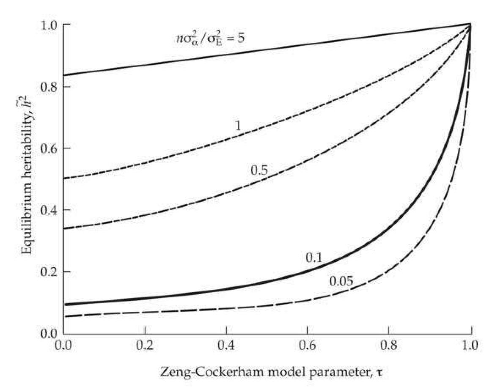

# Chapter 28 · Mutational Models and Quantitative Variation

## chapter28_005 · MUTATION-DRIFT EQUILIBRIUM / Mutational Models and Quantitative Variation

Chapters 11 and 12 developed the quantitative-genetic analog of $H$ by considering the expected additive variance, $\sigma_A^2$, that is maintained by neutral alleles in mutation-drift equilibrium. Two extensions, both concerning mutation, are required when moving from allelic frequencies to quantitative-trait variation. The first is that the *mutational variance* (the total amount of genetic variation arising in each generation), $\sigma_m^2$, replaces the mutation rate, $\mu$ (Chapter 11). The *mutational variance* contributed by (diploid) locus $i$ is $2\mu_i\sigma_{\alpha_i}^2$, the product of its mutation rate and $\sigma_{\alpha_i}^2$, the variance of *mutational effects* (or *mutational-effects* variance). We use $\sigma_m^2$ to denote an unspecified locus and $\sigma_{\alpha_i}^2$ to denote a specified one. With $n$ equivalent loci, $\sigma_m^2 = 2n\mu\sigma_{\alpha_i}^2$, while $\sigma_m^2 = 2\sum_i\mu_i\sigma_{\alpha_i}^2$ when mutational effects vary over loci.

**[Table]**

> **Table 28.1** · `28.1` · page 5 · source: `chapter28_005`
> Table 28.1 Models for the effect of a new mutation on a quantitative trait. All make the infinite-alleles assumption that each new mutation creates a new allele. The effect,  $ x' $, of this new allele is a function of its current value, x, and a random variable,  $ \alpha \sim (0, \sigma_{\alpha}^2) $. The incremental and house-of-cards (HOC) models are special cases of the Zeng-Cockerham regression model, corresponding to  $ \tau = 1 $ and  $ \tau = 0 $, respectively. Derivations can be found in Chapter 11, and in Zeng and Cockerham (1993).
>
> Model | New Effect | $ \widetilde{\sigma}_{A}^{2} $ | $ \widetilde{\sigma}_{A}^{2} $ as $ N_{e} \rightarrow \infty $
> --- | --- | --- | ---
> Incremental, Random-walk, Brownian-motion | $ x' = x + \alpha $ | $ 4N_{e}\mu n\sigma_{\alpha}^{2} = 2N_{e}\sigma_{m}^{2} $ | Unbounded
> House-of-cards | $ x' = \alpha $ | $ \frac{8N_{e}\mu n\sigma_{\alpha}^{2}}{1 + 4N_{e}\mu} = \frac{4N_{e}\sigma_{m}^{2}}{1 + 4N_{e}\mu} $ | $ 2n\sigma_{\alpha}^{2} = \frac{\sigma_{m}^{2}}{\mu} $
> Regression | $ x' = \tau x + \alpha $ | $ \frac{8N_{e}\mu n\sigma_{\alpha}^{2}}{(1 + \tau)[1 + 4N_{e}\mu(1 - \tau)]} = \frac{4N_{e}\sigma_{m}^{2}/(1 + \tau)}{1 + 4N_{e}\mu(1 - \tau)} $ | $ \frac{2n\sigma_{\alpha}^{2}}{1 - \tau^{2}} = \frac{\sigma_{m}^{2}}{\mu(1 - \tau^{2})} $

As reviewed in LW Chapter 12, the mutational variance can be estimated from the accumulation of additive variance in inbred lines. Such estimates are usually scaled by the environmental variance to yield the mutational heritability, $ h_m^2 = \sigma_m^2 / \sigma_E^2 $, and a typical value is $ h_m^2 = 10^{-3} $ (LW Table 12.1). Estimates of the component features of the mutational variance--the number of loci, $ n $; the per-locus mutation rate, $ \mu $; and the variance of mutational effects, $ \sigma_\alpha^2 $--are far more difficult to obtain. This is unfortunate, as many of the following models require the values of these components ($ n $, $ \mu $, and $ \sigma_\alpha^2 $), rather than their composite measure, $ \sigma_m^2 $. Some crude estimates follow from the widespread observation that $ h_m^2 $ is typically on the order of $ 10^{-3} $. If we assume that $ \sigma_\alpha^2 / \sigma_E^2 = 1 $, then the total trait mutation rate, $ 2n\mu $, will be on the order of $ 10^{-3} $. For $ n = 100 $ loci, this implies a per-locus mutation rate (to new trait alleles) of $ \mu = 5 \cdot 10^{-6} $. If the scaled variance of mutational effects is lower, then either the number of loci and/or the per-locus mutation rate must be correspondingly higher. Lyman et al. (1996) estimated a value of $ \sigma_\alpha^2 / \sigma_E^2 \simeq 0.1 $ for Drosophila bristle number mutations generated by P-element insertions. For $ h_m^2 = 10^{-3} $, this implies $ 2n\mu = 0.01 $ (assuming that $ \sigma_\alpha^2 $ and $ \mu $ for P-element insertions are representative of the wider mutational spectrum, which is unlikely).

**[推导 Derivation]**

The second required extension is some assumption relating the current effect of an allele, $ x $, with its effect, $ x' $, after mutation (Table 28.1). (While we typically use a to denote allelic effects, given the close similarity to our use of $ \alpha $ for the mutational effect, for clarity we will often use $ x $ in this chapter to denote an allelic effect.) The most widely used construct is the incremental model (also referred to as the Brownian-motion or random-walk model). Initially introduced by Clayton and Robertson (1955), and more formally by Crow and Kimura (1964) and Kimura (1965a), this model assumes that $ x' = x + \alpha $, the pre-mutation value plus a random increment, where $ \alpha \sim (0, \sigma_{\alpha}^2) $. When all mutations are additive, Equation 11.20c gives the (diploid population) mutation-drift equilibrium variance under this model as $ \tilde{\sigma}_A^2 = 2N_e \sigma_m^2 $. Equation 11.22a shows the expression for the additive variance when dominance is present. From Equation 11.21a, the expected equilibrium heritability becomes

> **Formula (28.1)** · `28.1` · source: `chapter28_block_019` · Mutational Models and Quantitative Variation
>
> $$ \widetilde{h}^{2}=\frac{2N_{e}h_{m}^{2}}{1+2N_{e}h_{m}^{2}}=1-\frac{1}{1+2N_{e}h_{m}^{2}} $$

Note the connection with the expression for neutral allelic heterozygosity, $ \widetilde{H} $, as both are of the form $ 2N_e y/(1 + 2N_e y) $, with $ y = h_m^2 $ for heritability and $ y = 2\mu $ for heterozygosity. As with $ \widetilde{H} $, even modest values of $ N_e (\sim 1000) $ return $ \widetilde{h}^2 $ values over 0.5, while larger values return heritabilities of close to one. For example, when $ h_m^2 = 0.001 $, $ N_e $ is constrained to be in the range of 50-1200 in order to recover typical heritability values (0.1 to 0.6). As noted in Chapter 11, the incremental mutational model represents one extreme, wherein the value of the new mutation is closely tied to the evolutionary history (x) of its parental allele. The other extreme is the house-of-cards (HOC) model, which was formally developed by Kingman (1977, 1978; although also assumed by Wright 1948b, 1969). Under $ HOC $, $ x' = \alpha $, independent of an allele's starting value $ x $, where again $ \alpha \sim (0, \sigma_{\alpha}^2) $, so that past evolutionary history is completely irrelevant.

**[推导 Derivation]**

The incremental and HOC models present two extremes, one strongly influenced by evolutionary history and the other completely indifferent to it. Zeng and Cockerham (1993) proposed a more general regression model, $ x' = \tau x + \alpha $, where $ 0 \leq \tau \leq 1 $ and $ \alpha \sim (0, \sigma_{\alpha}^2) $ (Table 28.1). The regression coefficient, $ \tau $, indicates the importance of past evolutionary history, recovering the incremental ($ \tau = 1 $) and HOC ($ \tau = 0 $) as special cases. This regression model is an Ornstein-Uhlenbeck process (Equation A1.33), as $ E[\Delta x] = E[x' - x] = -(1 - \tau)x $. The parameter $ \tau $ counters the diffusive effects of Brownian motion (the incremental random $ \alpha $) by exerting a restoring force toward the origin, and thus producing a bounded equilibrium distribution for $ \tilde{\sigma}_A^2 $ (for $ \tau < 1 $). Under the regression model (provided $ \tau \neq 1 $), the equilibrium additive variance in a large population is bounded by $ \sigma_m^2 / [\mu(1 - \tau^2)] $, with a resulting heritability of

> **Formula (28.2a)** · `28.2a` · source: `chapter28_block_021` · Mutational Models and Quantitative Variation
>
> $$ \begin{align*}\widetilde h^2=\frac{\sigma_m^2/[\mu(1-\tau^2)]}{\sigma_m^2/[\mu(1-\tau^2)]+\sigma_E^2}=1-\frac{1}{K+1}\end{align*} $$

where

> **Formula (28.2b)** · `28.2b` · source: `chapter28_block_021` · Mutational Models and Quantitative Variation
>
> $$ K=\frac{h_{m}^{2}}{\mu(1-\tau^{2})}=\frac{2\mu n\sigma_{\alpha}^{2}/\sigma_{E}^{2}}{\mu(1-\tau^{2})}=\frac{2n\sigma_{\alpha}^{2}/\sigma_{E}^{2}}{1-\tau^{2}} $$

**[Figure]**

> **Figure 28.2** · page 6 · source: `chapter28`
>
> 
>
> Figure 28.2 The expected heritability,  $ h^2 $, for large  $ N_e $, at mutation-drift equilibrium under the mutational regression model of Zeng and Cockerham (Equation 28.2a). This model includes the incremental ( $ \tau = 1 $) and HOC ( $ \tau = 0 $) models as special cases. Curves denote different values of  $ h_m^2/(2\mu) = n\sigma_a^2/\sigma_E^2 $, the ratio of the mutational heritability to the per-locus mutation rate.

Figure 28.2 plots $ \tilde{h}^2 $ as a function of $ \tau $ and $ h_m^2/(2\mu) = n\sigma_\alpha^2/\sigma_E $ (the scaled variance of mutational effects over all loci). The expected heritability increases as the role of past evolutionary history of an allele becomes increasingly important in predicting its mutated value (i.e., $ \tilde{h}^2 $ increases with $ \tau $). Likewise, $ \tilde{h}^2 $ increases with the total variance of mutational effects, $ n\sigma_\alpha^2 $. Assuming a typical value of $ h_m^2 = 0.001 $, an underlying per-locus mutation rate of $ \mu = 10^{-3} $

(implying $ 2n\sigma_\alpha^2 = \sigma_E^2 $) and a value of $ \tau = 0.5 $ gives $ K = 2 $ and $ \hbar^2 = 0.67 $. This decreases to 0.5 as we approach the HOC model ($ \tau = 0 $), and increases to one as we approach the incremental model ($ \tau = 1 $). Assuming that $ h_m^2 = 0.001 $ is a standard value for many traits, for large $ N_e $ this model requires a very high per-locus mutation rate ($ \mu > h_m^2 \sim 0.001 $; implying $ K < 1 $), otherwise the predicted heritabilities are too large. As with the incremental model, Equation 28.2a ignores the impact of deleterious mutations, and thus gives an upper limit on the equilibrium heritability.
