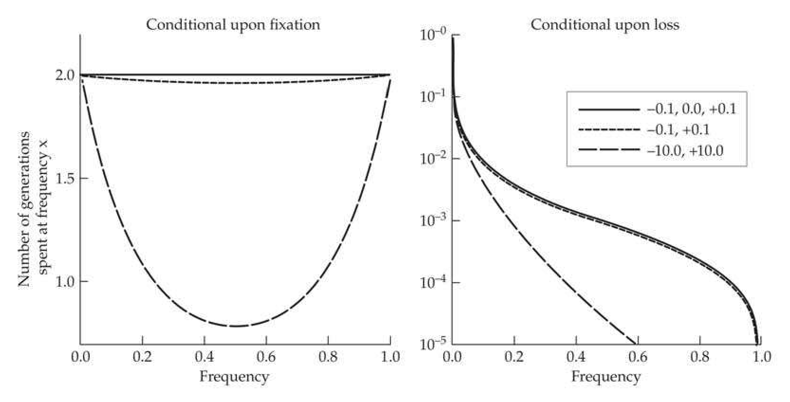

# Chapter 7 · Probability of Fixation

## chapter7_005 · SELECTION AND DRIFT AT SINGLE LOCI / Probability of Fixation Under Additive Selection

There is no possibility of having a perfectly stable polymorphism when drift and selection interact. Indeed, even in the case of overdominant selection (where there is a stable equilibrium in an infinite population; Chapter 5), one allele will eventually drift to fixation unless both homozygotes are lethal. Under this scenario, all new mutations ultimately become either lost or fixed at the population level, and those that become fixed will themselves be subject to replacement by subsequently arising mutations. Thus, when finite populations are considered, we need to think in terms of fixation probabilities and sojourn times of mutations. Even highly favorable alleles have fixation probabilities of less than 1.0 to a degree that depends on the initial frequency $ p_0 $, the strength of selection, and the effective population size $ N_e $.

**[推导 Derivation]**

Suppose we denote by $ u_f(p_0) $ the probability that an allele starting at initial frequency $ p_0 $ will become fixed. As noted in Chapter 2, under neutrality, the probability of fixation depends only on an allele's initial frequency regardless of population size, so that

> **Formula (7.9)** · `7.9` · source: `chapter7_block_031` · Probability of Fixation Under Additive Selection
>
> $$ u_{f}(p_{0})=p_{0} $$

**[推导 Derivation]**

Depending on the magnitude and direction of selection, this probability will either increase or decrease. When allelic effects on fitness behave additively, such that each copy of allele a changes fitness by s (giving fitnesses of 1, 1 + s, and 1 + 2s)

> **Formula (7.10a)** · `7.10a` · source: `chapter7_block_032` · Probability of Fixation Under Additive Selection
>
> $$ u_{f}(p_{0})\simeq\frac{1-e^{-4N_{e}sp_{0}}}{1-e^{-4N_{e}s}} $$

> **Formula (7.10b)** · `7.10b` · source: `chapter7_block_032` · Probability of Fixation Under Additive Selection
>
> $$ \simeq p_{0}+2N_{e}sp_{0}(1-p_{0})\quad when2N_{e}|s|\leq1 $$

Equation 7.10a, due to Kimura (1957) with a slightly improved version given by Cash (1977), was derived using diffusion theory in Appendix 1. The simplified version, Equation 7.10b, was developed by Robertson (1960a) using the Taylor series approximation $ e^{-x} \simeq 1 - x + x^2 / 2 $ for $ |x| \ll 1 $, and an alternative derivation is given below. Although these approximations apply to both beneficial $ (s > 0) $ and deleterious $ (s < 0) $ alleles, and work especially well with favorable alleles (Carr and Nassar 1970), they can significantly overestimate the fixation probabilities of highly deleterious alleles ($ N_e \leq -1 $), an issue examined in detail by Burger and Ewens (1995).

It is critical to note that even when an allele is under strong selection, drift still plays a powerful role when allele frequencies are near zero. Starting with a single copy of an advantageous allele (with frequency $ p_0 = 1/(2N) $, where $ N $ is the number of reproductive adults in the population), Equation 7.10a implies that the probability of fixation of a new mutation is approximately $ 2s(N_e/N) $ when $ 4N_e s \gg 1 $. As we expect $ N_e $ to generally be $ \ll N $ (Chapter 3) and $ s $ is typically $ \ll 1 $, this implies that a newly arisen favorable mutation will usually be lost by drift, no matter how beneficial. However, once the frequency of a strongly beneficial allele becomes sufficiently high, fixation is almost certain. For example, if $ N_{e}sp_0 > 0.5 $, the probability of fixation exceeds 0.70, while if $ N_{e}sp_0 > 1 $, the probability of fixation exceeds 0.93.

**[推导 Derivation]**

For mutations with a weak effect, it is informative to consider the probability of fixation of a newly arisen mutation relative to the neutral expectation of $ 1/(2N) $. Returning to Equation 7.10a, and approximating the numerator as $ 4N_{e}sp_{0} $, with $ p_{0}=1/(2N) $, the scaled probability of fixation

> **Formula (7.11)** · `7.11` · source: `chapter7_block_035` · Probability of Fixation Under Additive Selection
>
> $$ u_{f}^{\prime}(p_{0})=\frac{u_{f}(p_{0})}{1/(2N)}\simeq\frac{4N_{e}s}{1-e^{-4N_{e}s}}=\frac{S}{1-e^{-S}} $$

is found to be entirely a function of the composite parameter $ S = 4N_e s $, which, as noted above, is a measure of the strength of selection (2s in favor of homozygotes) relative to that of drift, $ 1/(2N_e) $ (Figure 7.1). For positive selection with $ S = 0.01 $, 0.1, and 1.0, respectively, $ u_f'(p_0) \simeq 1.005 $, 1.05, and 1.58, respectively, whereas with negative selection with the same absolute values, $ u_f'(p_0) \simeq 0.995 $, 0.95, and 0.58, respectively. This shows that the fixation probability of a mutant allele will be very close to the neutral expectation of $ 1/(2N) $ provided $ |S| \ll 1 $. This domain of effectively neutrality is potentially significant in a number of different contexts. For example, populations of sufficiently small size are unable to purge deleterious mutations or promote beneficial mutations with $ |s| < 1/(4N_e) $.

**[推导 Derivation]**

A number of other useful approximations for alleles with additive effects on fitness have been derived from diffusion theory. For example, Kimura (1969) found that the average cumulative contribution of a new mutation to the population-level heterozygosity (summed over all generations until it is lost or fixed) is equal to

> **Formula (7.12)** · `7.12` · source: `chapter7_block_036` · Probability of Fixation Under Additive Selection
>
> $$ H_{T}=\left(\frac{4N_{e}}{N}\right)\left(\frac{S-1+e^{-S}}{S[1-e^{-S}]}\right) $$

**[Figure]**

> **Figure 7.1** · page 8 · source: `chapter7`
>
> 
>
> Figure 7.1 Probability of fixation (solid line) and lifetime contribution to heterozygosity (dashed line) of a new mutant allele with additive effects on fitness as a function of  $ 4N_{e}s $ (using Equations 7.11 and 7.12), both relative to the neutral expectation.

Although this measure may seem somewhat abstract, the product of $ H_T $ times the number of new mutations arising in the population per generation, $ 2N_\mu $, is equal to the expected heterozygosity under selection-mutation-drift equilibrium. For neutral mutations ($ S \to 0 $), $ H_T \to 2N_e/N $, implying an expected heterozygosity of $ 4N_e\mu $ (which, assuming $ 4N_e\mu \ll 1 $, is consistent with results in Chapter 2 that were obtained by a different method). For large positive values of $ S $ (strongly beneficial mutations), $ H_T $ approaches a limiting value of $ 4N_e/N $, implying that on a per-mutation basis, such mutations make twice the contribution to the heterozygosity as neutral mutations. Finally, for deleterious mutations with sufficiently strong effects to be eliminated by selection, $ H_T \simeq 2/(N|s|) $. As in the case of the fixation probability, the expected heterozygosity at a locus scaled to the neutral expectation (dividing $ 2N\mu H_T $ by $ 4N_e\mu $) is a simple function of $ S $ (Figure 7.1). Viewed in this way, it can be seen that although both the relative fixation rate and the contribution to heterozygosity increase with S, the former responds much more rapidly. This is because deleterious mutations that essentially never fix in a population nevertheless make transient contributions to the heterozygosity prior to their elimination by selection, whereas positively selected mutations that are driven through the population relatively rapidly contribute to heterozygosity for only a relatively short period of time.

**[推导 Derivation]**

A useful approximation for newly arisen mutations with additive effects is that, conditional upon fixation, the expected number of generations spent at frequency x will be

> **Formula (7.13a)** · `7.13a` · source: `chapter7_block_038` · Probability of Fixation Under Additive Selection
>
> $$ \Phi_{f}(x)=\frac{2N_{e}(1-e^{-Sx})(1-e^{-S(1-x)})}{SNx(1-x)(1-e^{-S})} $$

where $ x = 1/(2N), \cdots, (2N - 1)/(2N) $ (from Equation 8.66 in Kimura 1983). There are two notable points with respect to this residence-time relationship (Figure 7.2). First, provided $ |S| < 1.0 $, conditional upon fixation, a new mutant allele will spend approximately $ 2N_e/N $ generations in each frequency class. Second, the residence-time features of a deleterious mutation en route to fixation are exactly the same as those for a beneficial mutation with the same absolute fitness effects, implying that both have the same mean time to fixation, even though the probability of fixation is lower in the former case. First pointed out by Maruyama and Kimura (1974), this counterintuitive behavior results from the fact that if a deleterious allele is to become fixed, it must do so as a consequence of some fortuitously rapid and extreme sampling errors.

**[推导 Derivation]**

It is also sometimes useful to know the expected residence times of mutations that eventually become lost, $ \Phi_{l}(x) $. From Equation 8.70 in Kimura (1983), the unconditional mean residence time for mutations (regardless of being fixed or lost) is

> **Formula (7.13b)** · `7.13b` · source: `chapter7_block_039` · Probability of Fixation Under Additive Selection
>
> $$ \begin{align*}\Phi(x)={{2N_e(1-e^{-S(1-x)})\over Nx(1-x)(1-e^{-S})}}\end{align*} $$

and using the fact that

> **Formula (7.13c)** · `7.13c` · source: `chapter7_block_039` · Probability of Fixation Under Additive Selection
>
> $$ \begin{align*}\Phi(x)=u_f(1/2N)\cdot\Phi_f(x)+[1-u_f(1/2N)]\cdot\Phi_l(x)\end{align*} $$

yields the residual times conditional upon eventual loss

> **Formula (7.13d)** · `7.13d` · source: `chapter7_block_039` · Probability of Fixation Under Additive Selection
>
> $$ \Phi_{l}(x)=\frac{N_{e}e^{Sx}(e^{S(1-x)}-1)^{2}}{N^{2}x(1-x)(e^{S}-1)(e^{S[1-(1/2N)]}-1)} $$

---

## chapter7_006 · Interaction of Selection, Mutation, and Drift: Introduction / Probability of Fixation Under Additive Selection

**[Figure]**

> **Figure 7.2** · page 9 · source: `chapter7`
>
> 
>
> Figure 7.2 Average number of generations that a new mutation spends within different frequency classes,  $ x = 1/(2N), \cdots, (2N - 1)/(2N) $, conditional on going to fixation (Left) or conditional on being lost (Right), given as a function of the scaled selection parameter  $ S = 4N_e s $ (inset values), obtained using Equations 7.13a and 7.13d, with  $ N = N_e = 1000 $. Note that in each case, the results are identical for beneficial and deleterious mutations with the same absolute values of  $ s $. With  $ N_e \neq N $, the results must be multiplied by  $ N_e/N $.

Again, we see that the residence times conditional upon loss are essentially the same for positive and negative selection coefficients of the same absolute magnitude (Figure 7.2). This is not true for the unconditional residence times, $ \Phi(x) $, which are functions of $ \Phi_f(x) $ and $ \Phi_l(x) $ weighted by the probabilities of fixation and loss (Equation 7.13c).

**[推导 Derivation]**

For effectively neutral mutations destined to loss, $ |S| < 1.0 $,

> **Formula (7.14a)** · `7.14a` · source: `chapter7_block_041` · Probability of Fixation Under Additive Selection
>
> $$ \Phi_{l}(x)\simeq\frac{N_{e}(1-x)}{N\lambda x} $$

where $ \lambda = 1 - [1/(2N)] $, whereas the unconditional residence time is

> **Formula (7.14b)** · `7.14b` · source: `chapter7_block_041` · Probability of Fixation Under Additive Selection
>
> $$ \Phi(x)\simeq\frac{N_{e}}{Nx} $$

i.e., the average time spent in frequency class x is inversely proportional to x.

**[推导 Derivation]**

The preceding expressions are useful in a number of applications. For example, the mean numbers of generations to fixation, loss, or either (removal of either allele) can be obtained, respectively, by summing Equations 7.13a, 7.13d, and 7.13c over all frequency classes in the interval $ [(1/(2N), 1 - 1/(2N))] $. Simplifications can be made possible in some cases. For example, as noted above, a neutral mutation that is destined for fixation spends an average of $ 2N_e/N $ generations in each frequency class, and because there are $ 2N - 1 $ classes, the time to fixation of effectively neutral alleles is essentially $ 4N_e $ generations, an outcome obtained in Chapter 2 by different means. The conditional time to loss of a neutral mutation is

> **Formula (7.15)** · `7.15` · source: `chapter7_block_042` · Probability of Fixation Under Additive Selection
>
> $$ t_{l}=\frac{2N_{e}\ln(2N)}{N\lambda} $$

**[推导 Derivation]**

(derived in Example A1.8). The mean number of generations until the complete loss of a new mutation with a deleterious heterozygous effect of s < 0 is

> **Formula (7.16)** · `7.16` · source: `chapter7_block_043` · Probability of Fixation Under Additive Selection
>
> $$ t_{l}\simeq2(N_{e}/N)[\ln(2N/|S|)+0.423] $$

provided $ |S| \gg 1 $ (Kimura and Ohta 1969b; Nei 1971). More general expressions, which require some numerical integration, can be found in Kimura and Ohta (1969a).

**[推导 Derivation]**

Knowing the mean total number of copies descendent from a mutation prior to its loss or fixation is useful in a number of contexts, e.g., determining the total number of individuals affected by a deleterious mutation. This is defined as

> **Formula (7.17a)** · `7.17a` · source: `chapter7_block_044` · Probability of Fixation Under Additive Selection
>
> $$ \overline{n}=\sum_{y=1}^{2N-1}\Phi(y/2N)\cdot y $$

with a shift of the function $ \Phi $ to $ \Phi_{l} $ or $ \Phi_{f} $, leading to the expected numbers conditional on loss or fixation, respectively. For the case of neutral mutations

> **Formula (7.17b)** · `7.17b` · source: `chapter7_block_044` · Probability of Fixation Under Additive Selection
>
> $$ \overline{n}=4N_{e}\lambda $$

> **Formula (7.17c)** · `7.17c` · source: `chapter7_block_044` · Probability of Fixation Under Additive Selection
>
> $$ \overline{n}_{f}=4N_{e}N\lambda $$

> **Formula (7.17d)** · `7.17d` · source: `chapter7_block_044` · Probability of Fixation Under Additive Selection
>
> $$ \overline{n}_{l}=2N_{e}\lambda $$

The mean frequency prior to absorption is simply $ \overline{n}/(2N) $ divided by the average absorption time.

**[示例 Example]**

> **Example 7.4** · ref: `7.4` · source: `chapter7_006.json` · blocks 6–8
>
> Example 7.4. Although it is generally thought that selection will increase the determinism of a system, this is not necessarily the case. Cohan (1984b) showed that, starting with identical allele frequencies, the probability of divergence between replicate populations can increase relative to the situation under pure drift if the initial frequency of the advantageous allele is sufficiently small. We refer to this phenomenon as the Cohan effect. This point can easily be seen as follows. Supposing two replicate populations are segregating alleles A and a at a locus, with the frequency of A being p = 0.25, then under pure drift, the probability that one replicate will become fixed for A and the other for a is 2 - 0.25 - (1 - 0.25) = 0.375. Now suppose that A is favored by selection, with $ N_{\ell,s} = 0.5 $. Again assuming $ p_0 = 0.25 $, Equation 7.10a gives the fixation probability of A as 0.46, implying that the probability of fixing alternative alleles is 2 - 0.46 - 0.54 = 0.496. Thus, in this case, divergence is substantially increased by the interaction between selection and drift.
> 
> In general, the probability of fixing alternative alleles in two replicates is $ 2u_f(p) $ $ [1 - u_f(p)] $, which is maximized when $ u_f(p) = 1/2 $. Thus, the probability of divergence is increased by selection if $ u_f(p) $ under selection is closer to 1/2 than $ u_f(p) = p $ under drift; and because $ u_f(p) > p $ for a selectively favored allele, a minimum requirement for increased divergence under pan-selection is that the starting frequency of the advantageous allele be < 1/2. Figure 7.3 shows that under additive selection, the conditions for the probability of divergence under drift plus selection to exceed that under drift alone are not very restrictive.
> 
> The Cohan effect has a number of practical implications. For example, an elevated level of population subdivision for a quantitative trait relative to the neutral expectation is often taken to imply that there are divergent selective regimes across subpopulations (Chapter 12). However, here we see that under identical directional selection pressures, populations that initiate with low-frequency, advantageous alleles can exhibit levels of divergence that are conventionally interpreted as being associated with diversifying selection. Whether allele frequencies, selection coefficients, and drift intensities commonly have the right mixes for uniform selection to enhance the magnitude of phenotypic divergence remains to be seen, but a wide range of conditions appears to yield divergence levels that would be difficult to discriminate from the neutral expectation (Lynch 1986).

---

## chapter7_007 · SELECTION AND DRIFT AT SINGLE LOCI / Probability of Fixation Under Arbitrary Selection

**[Figure]**

> **Figure 7.3** · page 11 · source: `chapter7`
>
> 
>
> Figure 7.3 The influence of drift on the probability of fixation of alternative alleles in a pair of populations starting from an identical state. A diallelic locus under additive selection with fitnesses 1, 1 + s, and 1 + 2s is considered. The slightly darker shaded area on the lower left is the region of  $ p_0 $ (the initial frequency of A) and  $ 4N_e $s space where the probability that isolated populations are eventually fixed for alternative alleles under selection and drift is higher than under drift alone. In this region, parallel selection increases the amount of evolutionary indeterminism relative to drift alone.

**[推导 Derivation]**

We now consider the more general model, allowing for dominance, with the genotypes aa, Aa, and AA having fitnesses of 1, 1 + sh, and 1 + 2s, respectively. Diffusion theory (as developed in Appendix 1) then shows the fixation probability of allele A as

> **Formula (7.18a)** · `7.18a` · source: `chapter7_block_049` · Probability of Fixation Under Arbitrary Selection
>
> $$ u_{f}(p_{0}\mid s,h)\simeq\frac{\displaystyle\int_{0}^{p_{0}}e^{G(x)}\; dx}{\displaystyle\int_{0}^{1}e^{G(x)}\; dx} $$

where

> **Formula (7.18b)** · `7.18b` · source: `chapter7_block_049` · Probability of Fixation Under Arbitrary Selection
>
> $$ G(x)=-4N_{e}s x(h-x) $$

**[推导 Derivation]**

For a new mutant introduced as a single copy, $ p_0 = 1/(2N) $, under random mating and at least partial dominance,

> **Formula (7.19a)** · `7.19a` · source: `chapter7_block_050` · Probability of Fixation Under Arbitrary Selection
>
> $$ \begin{align*}u_f\left({1\over2N}\right)\simeq{2N_e sh\over N[1-e^{-4N_e sh}]}\end{align*} $$

**[推导 Derivation]**

This shows that the probability of fixation of a new mutation is largely determined by the heterozygous effect, as almost all copies of a mutation remain in this state until the allele frequency has achieved a moderately high level. For a complete recessive $ (h = 0) $, the approximation leading to Equation 7.19a breaks down, and higher-order terms in the approximation of Equation 7.18a are required. However, for strong positive selection on homozygotes of a completely recessive allele $ (4N_e s \gg 1) $, a close approximation is given by

> **Formula (7.19b)** · `7.19b` · source: `chapter7_block_051` · Probability of Fixation Under Arbitrary Selection
>
> $$ u_{f}\left(\frac{1}{2N}\right)\simeq\frac{\sqrt{4N_{e}s/\pi}}{N} $$

(see Example A1.7 for details).

**[推导 Derivation]**

If there is direct inbreeding due to the mating of close relatives (beyond the amount of long-term inbreeding that is naturally generated by drift), Equation 7.18a will still hold, but now with

> **Formula (7.20a)** · `7.20a` · source: `chapter7_block_053` · Probability of Fixation Under Arbitrary Selection
>
> $$ G(x)=-4N_{e}s x[2f+(1-f)(h-x)] $$

where f is a measure of the departure of genotypes from Hardy-Weinberg expectations, defined (in Chapter 2) by the frequency of heterozygotes, $ 2p(1-p)(1-f) $ (Caballero and Hill 1992b). Using Equation 7.18a, the fixation probability now becomes

> **Formula (7.20b)** · `7.20b` · source: `chapter7_block_053` · Probability of Fixation Under Arbitrary Selection
>
> $$ u_{f}\left(\frac{1}{2N}\right)\simeq\frac{2N_{e}s[2f+(1-f)h]}{N} $$

**[推导 Derivation]**

(Caballero and Hill 1992b; Caballero 1996), which, for a complete recessive $ (h = 0) $, reduces to

> **Formula (7.20c)** · `7.20c` · source: `chapter7_block_054` · Probability of Fixation Under Arbitrary Selection
>
> $$ u_{f}\left(\frac{1}{2N}\right)\simeq\frac{4N_{e}f s}{N} $$

Thus, with even a small amount of inbreeding, the probability of fixation of a beneficial recessive allele is considerably higher than under random mating (Equation 7.19b) due to the elevated exposure in homozygotes (Caballero et al. 1991). In contrast, inbreeding has much more moderate effects on the fixation probabilities of alleles with additive $ (h=1) $ or dominant $ (h=2) $ fitness effects. Glemin (2012) showed that inbreeding also speeds up the loss and fixation times of a new allele relative to panmixia.

**[推导 Derivation]**

By indirectly causing localized inbreeding, population subdivision can also influence the probability of fixation. Whitlock (2003) found that, for a wide variety of population structures, the global probability of fixation of a new beneficial mutation is well approximated by

> **Formula (7.21)** · `7.21` · source: `chapter7_block_056` · Probability of Fixation Under Arbitrary Selection
>
> $$ u_{f}\left(\frac{1}{2N}\right)=\frac{2N_{e}s h(1-F_{S T})}{N} $$

where the effective and total population sizes $ (N_e $ and $ N) $ are defined at the metapopulation level and $ F_{ST} $ is an index of population subdivision (defined as the fraction of metapopulation variation for neutral alleles that is distributed among populations; see Chapter 2). Note that with complete population subdivision $ (F_{ST} = 1) $, fixation is impossible at the metapopulation level as mutations will be permanently confined to the demes in which they arise.

**[命题 Proposition]**

One cannot immediately infer from Equation 7.21 whether population subdivision will enhance or reduce the probability of fixation because subdivision influences both $ F_{ST} $ and $ N_{e} $. Expressions for effective population sizes under a number of metapopulation structures were presented in Chapter 3, and parallel expressions for $ F_{ST} $ can be found in most of the literature cited there. In the case of the ideal island model with symmetric migration between demes and equal contributions of all demes to the entire metapopulation (Chapter 3), $ N_{e} = N/(1 - F_{ST}) $, and Equation 7.21 reduces to 2hs, showing that in this particular case the probability of fixation is independent of the magnitude of population subdivision and simply equal to twice the selective advantage in heterozygotes (Maruyama 1970). Analyses of more complex population structures (Slatkin 1981b; Barton 1993) are all special cases of Whitlock's (2003) expression provided the assumption of equal deme productivity is met; and the modifications that are necessary when this condition are violated were developed by Whitlock (2003) as well. The more complex situation in which the strength of selection varies among demes was taken up by Whitlock and Gomulkiewicz (2005).

**[定义 Definition]**

Otto and Whitlock (1997) provided results for fixation probabilities in populations of changing size, and showed that selection is more effective in growing populations (increasing the probabilities that favorable alleles will be fixed and that deleterious alleles will be lost) than in declining populations. This result has obvious implications for managed populations. Fortuitously, the limiting expression for the fixation probability of alleles with additive effects (given above as $ 2sN_e/N $) applies to populations that are changing in size, provided appropriate modifications are made in the definition of $ N_e $ (Otto and Whitlock 1997). The much more complex issue of jointly varying population sizes and selection coefficients was taken up by Uecker and Hermisson (2011). Finally, a number of additional diffusion results are given for a diallelic locus in Appendix 1, but simple expressions are generally unavailable for multiple alleles.
