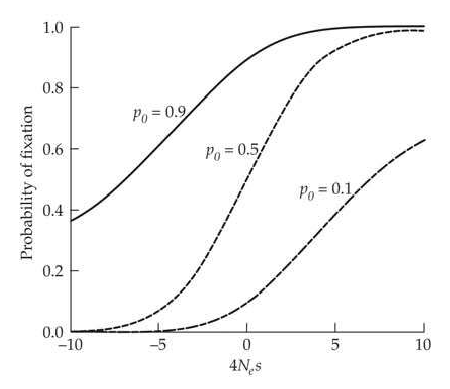

# 全书资料交付说明

本目录是《Evolution and Selection of Quantitative Traits》全书知识库整理结果的交付包，包含结构化知识单元、Markdown 教材正文、图片资源库以及图片映射索引。

## 目录结构

```text
全书资料/
├── structured/            # 结构化知识库 JSON
├── textbook/              # 全书 Markdown 教材正文
│   └── figures/           # Markdown 正文直接引用的图片
├── figures/               # 图片资源库，供 figure_library.json 映射使用
├── figure_library.json    # 全书图片索引库
└── README.md              # 本说明文件
```

## 数据规模

- `structured/`：991 个 JSON 文件。
- `textbook/`：264 个文件，其中包含 36 个 Markdown 正文/附录文件。
- `textbook/figures/`：228 张正文引用图片。
- `figures/`：228 张图片资源库图片。
- `figure_library.json`：228 条图片映射记录。
- `structured/formula_library.json`：2248 条公式记录。
- `structured/table_library.json`：164 条表格记录。
- `structured/example_library.json`：323 条例题记录。

## textbook 正文库

`textbook/` 中的 Markdown 文件按章节和附录命名：

```text
chapter1_textbook.md
chapter2_textbook.md
...
chapter30_textbook.md
appendix1_textbook.md
...
appendix6_textbook.md
```

正文中的图片使用相对路径引用：

```markdown

```

因此，阅读 Markdown 时需要保留同目录下的 `figures/` 文件夹，即：

```text
textbook/
├── chapter26_textbook.md
└── figures/
    └── fig_0124.png
```

## structured 结构化库

`structured/` 中每个章节片段一般采用如下命名：

```text
chapter26_001.json
chapter26_002.json
appendix1_001.json
```

典型结构如下：

```json
{
  "id": "chapter26_001",
  "metadata": {
    "chapter": "chapter26",
    "section": "Long-term Response: Introduction",
    "formula_references": [],
    "table_references": [],
    "heading_path": []
  },
  "blocks": [
    {
      "type": "discussion",
      "content": "..."
    }
  ]
}
```

主要字段说明：

- `id`：结构化片段编号，通常对应章节和顺序号。
- `metadata.chapter`：所属章节或附录。
- `metadata.section` / `heading_path`：片段所在标题层级。
- `metadata.formula_references`：该片段关联的公式编号。
- `metadata.table_references`：该片段关联的表格编号。
- `blocks`：正文块列表。
- `blocks[].type`：内容类型，例如 `discussion`、`figure`、`example` 等。
- `blocks[].content`：正文内容，保留 LaTeX 公式和引用占位符。

## 公式库

公式库位于：

```text
structured/formula_library.json
```

格式示例：

```json
{
  "id": "2.1",
  "label_format": "(2.1)",
  "latex": "P_{ij}=...",
  "formula_type": "block",
  "source": {
    "unit_id": "chapter2_block_008",
    "chapter": "chapter2",
    "subsection": "THE WRIGHT-FISHER MODEL"
  },
  "context": "...",
  "description": null
}
```

主要字段说明：

- `id`：公式编号，可被正文中的 `[[SEE_FORMULA:2.1]]` 引用。
- `label_format`：公式显示编号。
- `latex`：公式 LaTeX 内容。
- `formula_type`：公式类型，目前为块级公式。
- `source`：公式来源章节、单元和小节。
- `context`：公式在原文中的上下文。

## 图片库

图片索引位于：

```text
figure_library.json
```

图片文件位于：

```text
figures/
```

格式示例：

```json
{
  "figures": {
    "A2.1": {
      "id": "A2.1",
      "chapter": "appendix2",
      "placeholder": "[[FIGURE:A2.1]]",
      "see_placeholder": "[[SEE_FIGURE:A2.1]]",
      "asset_path": "figures/fig_0001.png",
      "caption": "...",
      "source_pdf": "data/背景资料/appendix2.pdf",
      "page": 9,
      "pdf_bbox": []
    }
  }
}
```

主要字段说明：

- `id`：图片编号，例如 `26.1`、`A2.1`。
- `chapter`：所属章节或附录。
- `placeholder`：完整插图占位符。
- `see_placeholder`：正文引用图片时使用的占位符。
- `asset_path`：图片文件相对路径，指向本目录下的 `figures/`。
- `caption`：图片标题说明。
- `source_pdf` / `page` / `pdf_bbox`：原始 PDF 来源页码和定位信息。

注意：`textbook/figures/` 和根目录下的 `figures/` 图片内容相同，但用途不同：

- `textbook/figures/`：供 Markdown 正文直接显示图片。
- `figures/`：供 `figure_library.json` 的 `asset_path` 映射使用。

如果只阅读 Markdown，可使用 `textbook/`；如果要保留完整图片库映射，应保留根目录下的 `figures/` 和 `figure_library.json`。

## 表格库

表格库位于：

```text
structured/table_library.json
```

格式示例：

```json
{
  "id": "1.1",
  "label_format": "Table 1.1",
  "title": "Table 1.1 ...",
  "table_type": "numbered",
  "html": "<table>...</table>",
  "rows": [
    ["Topic", "References"]
  ]
}
```

主要字段说明：

- `id`：表格编号，例如 `1.1` 或 `inline_1`。
- `label_format`：表格显示编号。
- `title`：表格标题。
- `table_type`：表格类型，包括编号表格和正文内联表格。
- `html`：HTML 表格。
- `rows`：二维数组形式的表格内容。

## 例题库

例题库位于：

```text
structured/example_library.json
```

格式示例：

```json
{
  "example_id": "2.1",
  "chapter": "chapter2",
  "label": "Example 2.1",
  "source_file": "chapter2_002.json",
  "content_markdown": "...",
  "content_plain": "...",
  "formula_refs": ["2.2b", "2.1"],
  "table_refs": ["inline_1"],
  "figure_refs": []
}
```

主要字段说明：

- `example_id`：例题编号。
- `chapter`：所属章节。
- `label`：例题显示标签。
- `source_file`：例题来源的结构化片段。
- `content_markdown`：保留 Markdown 和 LaTeX 的例题内容。
- `content_plain`：更接近纯文本的内容。
- `formula_refs` / `table_refs` / `figure_refs`：例题关联的公式、表格和图片编号。

## 常见引用占位符

结构化正文中可能出现以下占位符：

```text
[[SEE_FORMULA:2.1]]
[[SEE_FIGURE:26.1]]
[[TABLE:inline_1]]
[[SEE_EXAMPLE:2.1]]
```

含义如下：

- `SEE_FORMULA`：引用 `structured/formula_library.json` 中的公式。
- `SEE_FIGURE` / `FIGURE`：引用 `figure_library.json` 中的图片。
- `TABLE`：引用 `structured/table_library.json` 中的表格。
- `SEE_EXAMPLE`：引用 `structured/example_library.json` 中的例题。

## 完整性检查结果

本交付包已完成以下检查：

- `structured/` 源文件与交付文件数量一致。
- `textbook/` 源文件与交付文件数量一致。
- `figures/` 源文件与交付文件数量一致。
- 991 个结构化 JSON 文件均可正常解析。
- 36 个 Markdown 正文/附录文件中的 228 个图片引用均能找到对应图片。
- `figure_library.json` 中 228 条图片映射均能找到对应 `figures/*.png`。
- 228 张 PNG 图片均可正常打开。
- `formula_library.json` 中 2248 条公式记录均存在唯一编号。
- 结构化文件中的公式引用和 `[[SEE_FORMULA:...]]` 占位符均能映射到公式库。
